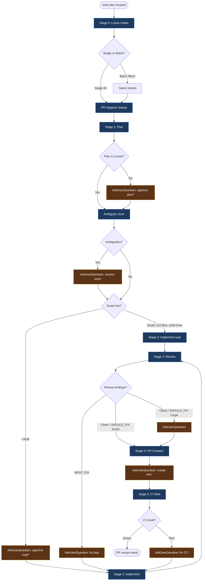

# Auto Dev Pipeline

Automated Linear→plan→implement→review→ship for development tickets.
Main session orchestrates. All work delegated to agents. Friction surfaced at checkpoints.
Scope determines which approvals are automatic vs manual.

**Arguments:** "$ARGUMENTS"

---

## Tracker Resolution (read first — before Stage 0)

This pipeline is **tracker-agnostic**. The document below is written in Linear
terms for historical reasons; resolve the active tracker once at the top of
every invocation and substitute its operations everywhere.

**Resolve the tracker:** read `.claude/project-config.yaml` →
`tracking.primary.system`. Recognized values: `github-issues` or `linear`.
If the file is absent or the key is missing, default to `linear` (legacy
behavior). Repos that track work in GitHub Issues MUST set `github-issues`
(see the companion `project-config.yaml`).

**Operation mapping** — wherever this document says "Linear", `get_issue`,
`list_comments`, "post to the Linear ticket", or "Linear comment/marker",
perform the active tracker's equivalent:

| Operation | `linear` | `github-issues` |
|-----------|----------|-----------------|
| Fetch ticket body | `get_issue(<id>)` | `gh issue view <n> --json title,body,state,url` |
| Fetch ticket comments | `list_comments(<id>)` | `gh issue view <n> --json comments` |
| Post a comment | Linear create-comment | `gh issue comment <n> --body <text>` (or `--body-file`) |
| Read plan/marker comments | scan Linear comments | scan `gh issue view <n> --json comments` (markers are HTML comments in the body, identical syntax) |
| Close on ship | Linear status → Done | `gh issue close <n>` — or rely on the PR's `Closes #<n>` trailer |
| Batch select (`--cycle`/`--label`/…) | `list_issues(filters)` | `gh issue list --json number,title,labels,state [--label …]` |

**`github-issues` mode — hard rules:**
- A bare integer argument (e.g. `403`) is a **GitHub issue number**. It is NOT
  free text and NOT a Linear ID. Resolve it with `gh issue view <n>`.
- **NEVER call the Linear MCP** (`get_issue` / `list_issues` /
  `mcp__plugin_linear_*` / Linear authenticate). If you are about to authorize
  Linear, you are in the wrong tracker mode — stop and use `gh`. In a headless
  run the Linear OAuth prompt cannot be answered and the session will silently
  stall until it is reaped (see the 2026-05-30 fanout-cascade RCA).
- All downstream "post to Linear" / "post the plan/ambiguities/premises to the
  ticket" instructions operate on the GitHub issue via `gh issue comment <n>`.
  Plan signoff markers (`<!-- plan-quality-reviewed -->` etc.) are HTML comments
  embedded in the issue comment body, exactly as in the Linear flow.
- `gh` runs against the repo at the worktree's `origin` remote — confirm with
  `gh repo view --json nameWithOwner` if ambiguous.

Everything below this section is unchanged in meaning; only the tracker
operations are substituted per the table above.

---

## Pipeline Flow



Checkpoints (amber) are automation gates — AUTO-SKIP for Small + Linear-authored plans, AskUserQuestion otherwise. See **Guard Matrix** below for the full rule set.

---

## Headless Mode

Pass `--headless` to run the pipeline with no interactive prompts. Every `AskUserQuestion` call is replaced by the deterministic action in the gate-collapse table below.

**Purpose:** autonomous orchestrator dispatch from `cw` (`mattwwarren/claude-workspace`). Issues cw#56–#59 are built against this contract and consume the structured output defined in the Appendix.

**Cross-repo spec:** [`claude-workspace/docs/headless-contract.md`](https://github.com/mattwwarren/claude-workspace/blob/main/docs/headless-contract.md) reformulates this section + the Appendix as a parser-implementer reference. This file (`commands/auto-dev.md`) is the producer source of truth; the spec doc is the link target for cw and any other consumer.

**Philosophy:** the human only sees the diff after the machine has done all deterministic cleanup it can. Two gates remain:
- Plan approval (large scope only) is the only "before work" gate.
- Review approval (large scope only) is the only "after work" gate.
Everything else runs to completion or exits with a structured error.

**Health aggregation rule:** If any spawned agent returns `On-spec confidence: LOW`, `Could work be incomplete?: MAYBE` or `YES`, or `Recommendation: EXIT_FOR_HUMAN_REVIEW`, downgrade the outcome:
- Small + clean review + all agents healthy → `shipped`
- Small + clean review + any degraded agent → downgrade to `review_pending_approval` (branch pushed, no PR)
- Large path is unchanged (already exits at S3), but include the full health summary in the result payload.
- When this rule downgrades the status, set `health.downgrade_applied: true` in the structured output. (Distinct from `health.fix_loop_escalated` which signals fix-loop escalation events — see Step 3b.5.)

**Agent spawn rule:** every agent prompt in headless mode MUST include BOTH the Friction Protocol block AND the Health Check block. Implementation and fix-loop agents MUST additionally include the Completion Artifacts block (see Subagent Reliability Mitigations section). Every spawn MUST set a wall-clock timeout per Mitigation 4 (recommended: 30m for impl, 15m for fix/review, 10m for lightweight); a non-returning task is treated as `agent_block`, not a hang.

**Out of scope in headless mode:**
- Batch mode (multi-ticket selection) — stays interactive-only; `--headless` with batch filters is undefined behavior
- PR Hygiene Sweep (Steps H1, H2) — stays interactive-only
- Stage 5b feedback fix agent — stays interactive-only

### Gate-Collapse Table

All 41 rows define the deterministic headless action for every interactive gate in the pipeline:

> **Maintenance:** the `expected 2` and `hard-cap at 5` cycle values appear in 6 locations across this file. See the maintenance note in Step 3b.5 for the full sync list before editing the cycle-related rows here.

| Stage / gate | Headless behavior |
|---|---|
| Pre-flight, local main not in sync with origin/main | EXIT `blocked` with `blocker.reason: "local_main_diverged_from_origin"`, `retry_eligible: true`, `next_actions: ["sync_local_main"]` (see Pre-flight section) |
| S1 plan, plan in Linear | AUTO-SKIP plan-approval question (ambiguity scan still runs) |
| S1 plan, no Linear plan, small | Generate → AUTO-APPROVE (ambiguity scan still runs) |
| S1 plan, no Linear plan, large | Generate → EXIT `plan_pending_approval` (post to Linear, no branch) |
| S1 ambiguity scan, no ambiguities | AUTO-CONTINUE |
| S1 ambiguity scan, ambiguities found | EXIT `ambiguities_pending_resolution` (post ambiguity list to Linear as a comment, no branch) |
| S1 ambiguity scan, non-empty `PREMISES TO VERIFY` | EXIT `premises_pending_verification` (post premise list to Linear as a comment, no branch — verification is human/investigation work, not a plan revision) |
| S1 pre-flight finds ticket already satisfied | EXIT `no_op` (no branch, `next_actions: ["close_issue_as_completed"]`) |
| S1 plan review, both markers present + current | AUTO-SKIP (no reviewer spawn, no marker re-append) |
| S1 spec review, NO_ISSUES / SHOULD_FIX / PRINCIPLE only | Append `plan-spec-reviewed` marker, continue |
| S1 spec review, MUST_FIX, 1st cycle | Spawn plan-revision agent (Step 1f.4), re-review once |
| S1 spec review, MUST_FIX persists after 1 revision | EXIT `blocked` with `blocker.reason: "plan_unreviewable"` |
| S1 soundness review, NO_ISSUES | Append `plan-soundness-reviewed` marker, continue |
| S1 soundness review, RISK (interactive) | AskUserQuestion per finding: acknowledge / treat as MUST_FIX / codify as §7. Then append marker |
| S1 soundness review, RISK (headless) | Write `codify:` lessons to the wiki inbox + `friction_highlights`, append marker, continue (advisory — never blocks) |
| S1 soundness review, MUST_FIX, interactive | AskUserQuestion: revise approach / override / skip ticket. On "revise" → Step 1f.4 |
| S1 soundness review, MUST_FIX, headless OR persists after 1 revision | EXIT `blocked` with `blocker.reason: "plan_unsound"` |
| S1 plan reviewer agent BLOCK (either station) | EXIT `blocked` with `blocker.reason: "agent_block"` |
| S1 scope-limit hit | EXIT `scope_exceeded` |
| S1 forbidden-area hit | EXIT `forbidden_area` |
| S2 impl checkpoint (any scope) | AUTO-CONTINUE — never gate |
| S2 BLOCK or 2x failure | EXIT `blocked` with `blocker.reason: "impl_failed"` |
| S2.5 branch not pushed (`origin/<branch>` absent after fetch) | EXIT `blocked` with `blocker.reason: "impl_not_pushed"`. Do NOT spawn reviewers |
| S2.5 completion gate fails (diff empty, test fail) | EXIT `blocked` with `blocker.reason: "impl_failed"`, `blocker.details: "Step 2.5 gate <N>: <output>"`. Do NOT spawn reviewers |
| S2.5 missing planned files | Treat as missing work; route to impl retry (counts against 2x failure budget) |
| S2.5 files outside plan | Append `"impl_scope_growth: <files>"` to `friction_highlights`; continue (routes through existing scope-growth handling) |
| S2 / S3b agent timeout (Mitigation 4) | EXIT `blocked` with `blocker.reason: "agent_block"`, `blocker.details: "agent timed out after <N>m"` |
| S2 / S3b single-commit on non-trivial change | Append `"impl_no_incremental_commits"` to `friction_highlights`; continue (advisory only) |
| S3 review (any scope) | Always run reviewers |
| S3 MUST_FIX (any scope) | Run fix loop; expected 2 cycles, hard-cap at 5 |
| S3b fix gate fails (test/mypy/diff mismatch / no new commits) | Count as cycle failure; re-spawn within 5-cycle cap; append `"fix_loop_gate_failed_cycle_<N>"` |
| S3 fix-loop, Small + sparse fix (Step 3b.5 criteria all hold) | Skip re-review → S4. Append `"rereview_skipped_sparse"` to `friction_highlights` |
| S3 review clean / SHOULD_FIX, small | AUTO-CONTINUE → S4 |
| S3 review clean / SHOULD_FIX, large | EXIT `review_pending_approval` (post-fix-loop diff, branch pushed, no PR) |
| S3 MUST_FIX persists after 5 cycles | EXIT `blocked` with `blocker.reason: "review_blocked"` |
| S3 fix-loop cycle 3+ OR scope growth at any cycle | Append to `friction_highlights`, set `health.fix_loop_escalated: true`, continue |
| Any other agent BLOCK (Plan / prep-pr / etc.) | EXIT `blocked` with `blocker.reason: "agent_block"` |
| Tool call denied by auto-mode classifier (any stage) | EXIT `blocked` with `blocker.reason: "tool_denied"`, `retry_eligible: true`, `next_actions: ["redispatch_ticket"]` (see Tool-Use Denial Exit section) |
| S4a merge gate (small only — large already exited) | EXIT `merge_gate_blocked` if prior pipeline PR open |
| S4b PR creation, small | AUTO-CREATE with auto-merge |
| S4d UI Evidence Gate, no UI files OR media present in body | AUTO-CONTINUE — enable auto-merge |
| S4d UI Evidence Gate, UI files present + body missing media | Skip auto-merge enable; append `"ui_evidence_missing"` to `friction_highlights`; set `pr.auto_merge: false`; set `next_actions: ["attach_ui_evidence_and_enable_automerge"]`; continue to Post-to-Linear |
| S5 CI wait | AUTO-SKIP — return immediately after auto-merge enabled. CI watching = orchestrator concern |
| Invoked with `--resume <ticket>` | Run `detect_current_stage()` and jump to the detected stage's entry point; emit `resumed_from_stage: "<stage>"` in the structured output. Skip Pre-flight and S0 (ticket already known). Not a blocker — informational only. If detector returns `pre_flight`, behave as a normal `--headless` run on `<ticket>` |
| S4 PR-exists check, branch already has open PR | Skip Step 4a/4b/4c; proceed to Step 4d (auto-merge enable + Linear comment if missing) and S5. Append `"pr_reused_existing"` to `friction_highlights` |
| S4 PR-exists check, branch has closed (unmerged) PR | EXIT `blocked` with `blocker.reason: "pr_already_terminal"`, `retry_eligible: false` — closed PR represents human decision; pipeline must not create a duplicate |
| Trailing /schedule asks | suppress |

---

## Resume Detection

Auto-dev runs `detect_current_stage(ticket_id)` at the top of every invocation. The detector is **pure derivation** from external state (Linear comments, git branch + commit trailers, GitHub PR fields). No `.auto-dev-state.json` or equivalent file is written — the branch, the Linear issue, and the PR are the state store.

### `--resume <ticket>` flag

Pass `--resume <ticket>` to resume a previously-started pipeline from the latest detected stage. Skips earlier stages entirely — no re-planning, re-implementing, or re-reviewing of work already marked complete via durable signals (Linear plan markers, branch commit trailers, PR state).

Combines with `--headless` for non-interactive resume (e.g. cron-driven retry of a ticket that previously exited `plan_pending_approval` and has since received approval). Without `--resume`, the detector still runs but is informational — used inside each stage to short-circuit redundant work (e.g. S1's existing marker-skip at the plan-reviewer step), not to jump stages.

### Durable signals

| Signal | Stored in | Meaning |
|---|---|---|
| `<!-- plan-quality-reviewed -->` + `<!-- plan-soundness-reviewed -->` markers | Linear plan comment | S1 reviewers ran; markers current |
| Approval comment on plan thread (human reply, or auto-approved-small flag) | Linear | S1 → S2 gate cleared |
| Branch exists on `origin/<branch>` | git | S2 started |
| Commit trailer `Auto-Dev-Stage: impl-complete` on a branch commit | git | S2 done; S3 may start |
| Commit trailer `Auto-Dev-Fix-Cycle: <N>` on a branch commit | git | S3 fix-loop cycle N reached |
| PR open for branch | GitHub | S4 done |
| PR checks state | GitHub | S5 substage |
| PR merged | GitHub | terminal |

### Stage states returned by the detector

`pre_flight` · `s1_drafting` · `s1_pending_ambiguity_resolution` · `s1_pending_human_approval` · `s1_plan_approved` · `s2_implementing` · `s3_review_pending` · `s3_fix_loop` (with substage `cycle_N`) · `s4_pr_open` · `s5_ci_pending` · `s5_ci_passed` · `s5_ci_failed` · `merged`

### Detection algorithm (highest stage wins)

1. **`gh pr view <branch>`** — if PR is MERGED → `merged`. If PR is OPEN, inspect checks: any failing → `s5_ci_failed`; all passing → `s5_ci_passed`; running → `s5_ci_pending`; none yet → `s4_pr_open`.
2. **Branch exists, no PR** — parse commit trailers on branch (commits unique vs `origin/main`). If `Auto-Dev-Stage: impl-complete` trailer present:
   - Any `Auto-Dev-Fix-Cycle: <N>` trailers on commits *newer than* impl-complete → `s3_fix_loop`, substage `cycle_max(N)`.
   - Otherwise → `s3_review_pending`.
   - No impl-complete trailer → `s2_implementing` (resume from current branch HEAD; do not reset).
3. **No branch, Linear plan comment present** — both quality+soundness markers present:
   - Scope `small` or approval comment found → `s1_plan_approved`.
   - Otherwise → `s1_pending_human_approval`.
   - Markers missing → `s1_drafting`.
4. **No branch, Linear ambiguity comment present** — user responses to ambiguities present → `s1_drafting`; otherwise → `s1_pending_ambiguity_resolution`.
5. **Nothing started** → `pre_flight`.

### Stage idempotency requirement

Every stage entry point MUST be idempotent. Calling S4 when a PR already exists must reuse the PR, never duplicate-create. Calling S2 when the branch already has commits must resume from HEAD, never reset. Per-stage Pre-Stage Detector Guard subsections enforce this — see S2 §Pre-Stage Detector Guard, S4 §Pre-Stage Detector Guard.

---

## Friction Protocol

Every agent prompt MUST end with this block verbatim:

```
FRICTION PROTOCOL — include this section at the END of your response:

## Friction Report
- **Level**: NONE | INFO | WARN | BLOCK
- **Scope**: N files changed, ~M lines
- **Assumptions**: [decisions you made without explicit guidance — if none, say NONE]
- **Deviations**: [anything done differently from plan/instructions — if none, say NONE]
- **Discoveries**: [unexpected findings: related bugs, dead code, schema surprises, scope creep risk — if none, say NONE]
- **Risks**: [shared code touched, interface changes, potential downstream breakage — if none, say NONE]

BLOCK level means you cannot proceed without user input. Explain what you need.
```

---

## Health Check Protocol

Every agent prompt in headless mode MUST ALSO end with this block, appended after the Friction Report:

```
## Health Check
- **Context usage**: <rough % or HIGH/MEDIUM/LOW>
- **On-spec confidence**: HIGH | MEDIUM | LOW
- **Shortcuts taken under pressure**: [list or NONE]
- **Could work be incomplete?**: NO | MAYBE | YES (explain)
- **Recommendation**: PROCEED | EXIT_FOR_HUMAN_REVIEW
```

The main session aggregates these reports per the rule documented in the Headless Mode section above. In interactive mode the block is optional but recommended.

---

## Tool-Use Denial Exit

The Claude Code auto-mode classifier can deny a tool call mid-pipeline (typical case: external-system writes like `gh issue comment` under the agent's identity). In interactive mode the human re-authorizes; in headless mode there is no human and no retry path, so an undirected denial produces a silent stall until the Layer 1 backstop times the session out (~30 min, see claude-workspace#176).

**Detection.** On every `tool_result` block with `is_error: true`, check whether the content begins with the literal phrase:

> `Permission for this action was denied by the Claude Code auto mode classifier`

Match is a case-sensitive substring check against the tool_result content. The classifier's deny message is structured and stable; do NOT loosen the match to "denied" alone (that would catch normal exit-code-1 errors).

**Action (headless).** On match, emit the `blocked` sentinel in the **same parent turn** as the denied tool result, before any other prose, then exit. Do NOT attempt to work around the denial with a different tool — the orchestrator's job is to re-dispatch under fresh classifier conditions (claude-workspace#183 — classifier non-determinism), not to evade.

**Sentinel shape:**

```json
{
  "schema_version": 4,
  "status": "blocked",
  "stage_reached": "<whichever stage was running>",
  "blocker": {
    "stage": "<same as stage_reached>",
    "reason": "tool_denied",
    "tool_name": "<Bash | Edit | Write | ...>",
    "denial_reason": "<verbatim classifier reason text after `Reason:`>",
    "details": "<verbatim full denial message>",
    "recovery_hint": "Re-dispatch the ticket; the auto-mode classifier is non-deterministic and may permit the same operation on a fresh session. If denial is reproducible, the operation belongs off the agent identity.",
    "retry_eligible": true,
    "retry_delay_seconds": null
  },
  "next_actions": ["redispatch_ticket"]
}
```

`retry_eligible: true` by default — the classifier is the source of non-determinism, not the plan or the impl. If a future denial form indicates a hard policy refusal (not yet observed), set `retry_eligible: false` and leave the orchestrator to surface to the human.

**Action (interactive).** The denial appears verbatim to the user in the normal tool-result stream; no skill action is required. The user re-authorizes or alters the operation as they would for any classifier prompt.

**Precedent.** This is the analogue of the Stage 4 `merge_gate_blocked` exit (a classifier-style gate that exits cleanly rather than stalling). Tool denial is the cross-stage version of the same principle.

---

## Guard Matrix

Two independent axes control approval automation.

**Axis 1 — Plan source (determines plan APPROVAL checkpoint, Checkpoint 1):**

| Condition | Plan Approval Checkpoint |
|-----------|----------------|
| Plan found in Linear issue (or issue description is sufficient) | AUTO-SKIP — pre-approved by authoring it |
| No plan / partial plan only | AskUserQuestion |

**Axis 1b — Plan signoff markers (determines plan REVIEW gate, Step 1f):**

Two independent markers, one per station — `<!-- plan-spec-reviewed: YYYY-MM-DD vN -->` and `<!-- plan-soundness-reviewed: YYYY-MM-DD vN -->`. For each:

- **Marker present + version current** → AUTO-SKIP that station. Cheap grep, no agent spawn.
- **Marker absent OR version stale** → spawn that station; gate per Step 1f.3.

A marker is appended only when its station clears (NO_ISSUES, SHOULD_FIX/PRINCIPLE-only, an acknowledged RISK, or an explicit human override). A blocking MUST_FIX never appends a marker — the plan must be revised first. Versions are bumped per station independently to invalidate that station's markers without forcing a re-review of the other.

**Axis 2 — Scope tier (determines impl + review checkpoints):**

| Tier | Criteria |
|------|----------|
| **Small** | ≤10 files AND ≤500 lines AND no forbidden-area touches |
| **Large** | >10 files OR >500 lines OR touches forbidden areas |

| Checkpoint | Small Scope | Large Scope |
|------------|-------------|-------------|
| Implementation | AUTO-ACCEPT (log summary) | AskUserQuestion |
| Review (clean / SHOULD_FIX only) | AUTO-ACCEPT | AskUserQuestion |
| Review (MUST_FIX) | AskUserQuestion (always) | AskUserQuestion (always) |
| PR creation | AskUserQuestion (always) | AskUserQuestion (always) |

---

## Pre-flight: Origin Sync Check

Runs once per `/auto-dev` invocation, before Stage 0. Fails fast when the local `main` branch is not in sync with `origin/main`, so the pipeline does not spend impl + review tokens on a feature branch that will be rejected at the Stage 4 merge gate.

**Why this exists:** the #170 v2 dogfood completed all the way through impl + 5 serial reviewers in 25 minutes, then correctly exited at Stage 4 with `status: merge_gate_blocked` — because the feature branch carried two unrelated commits from local `main` that had not yet been pushed to `origin/main`. Catching the divergence here saves the 25 minutes of work.

### Step P1: Fetch and compare

```bash
REPO=$(pwd)
git -C "$REPO" fetch origin main --quiet
LOCAL_MAIN=$(git -C "$REPO" rev-parse main)
ORIGIN_MAIN=$(git -C "$REPO" rev-parse origin/main)
AHEAD=$(git -C "$REPO" rev-list --count origin/main..main)
BEHIND=$(git -C "$REPO" rev-list --count main..origin/main)
```

If `LOCAL_MAIN == ORIGIN_MAIN`, continue to Stage 0.

If they differ, branch on mode:

### Step P2 (interactive)

`AskUserQuestion`: how to resolve the divergence.

| Option | Action |
|---|---|
| Sync now | If ahead-only: `git -C "$REPO" push origin main`. If behind-only: `git -C "$REPO" pull --ff-only`. If both ahead and behind: fall through to "proceed anyway" — the human must decide. |
| Proceed anyway | Continue to Stage 0 with the local main as the fork point. The feature branch will diverge from origin; the Stage 4 merge gate will still catch it. |
| Abandon ticket | Exit without spawning any agents. No sentinel emit. |

### Step P3 (headless)

EXIT with the structured `blocked` sentinel before any agent is spawned:

```json
{
  "status": "blocked",
  "stage_reached": "stage1_pre_flight",
  "blocker": {
    "stage": "pre_flight",
    "reason": "local_main_diverged_from_origin",
    "details": "local_main=<sha>, origin_main=<sha>, ahead=<n>, behind=<n>",
    "message": "Local main is not in sync with origin/main; pipeline aborted before impl",
    "recovery_hint": "Push or rebase local main, then re-dispatch",
    "retry_eligible": true,
    "retry_delay_seconds": null
  },
  "next_actions": ["sync_local_main"]
}
```

`retry_eligible: true` per ADR-0002 — the orchestrator MAY re-dispatch once the user resolves the divergence (typical resolution is a single `git push origin main` or `git pull --ff-only`). `retry_delay_seconds: null` because no time-based backoff helps; the gate clears when the human acts.

**Producer note:** `local_main_diverged_from_origin` is an open-enum addition to `blocker.reason` (per headless-contract.md §4.2 — `reason` is open by design). Consumers surface it verbatim; no parser change needed.

---

## Stage 0: Ticket Intake

First resolve the active tracker per **Tracker Resolution** above. The parse
rules below are tracker-aware.

1. Parse `$ARGUMENTS`:
   - **Ticket ID** → single-ticket mode, skip selection. What counts as an ID
     depends on the tracker:
     - `linear`: a Linear issue ID like `PROJ-1234`.
     - `github-issues`: a **bare integer** like `403` (a GitHub issue number) —
       or `#403`. Do NOT treat this as free text; do NOT query Linear for it.
   - **Filter flags** (`--cycle`, `--project`, `--label`, `--team`, `--state`, `--assignee`, `--priority`) → batch mode
   - **Free text** (no ID pattern, no flags) → use as description directly, no tracker lookup, no existing plan
   - **Mode flag** `--headless` → suppress all AskUserQuestion calls; apply gate-collapse table from the Headless Mode section for all downstream decision points. Independent of the input forms above (can combine with Linear ID, filters, or free text — though batch mode behavior in headless is undefined per the Headless Mode out-of-scope notes).

2. **Parse constraint flags** (used by `/auto-debt` alias):
   - `--scope-limit small` → reject tickets classified as Large
   - `--branch-prefix <prefix>` → override default `dev` branch prefix
   - `--forbidden <comma-separated areas>` → hard-reject tickets touching these areas

3. **Single-ticket mode:** Fetch the issue via the **active tracker's** fetch op
   (`get_issue(<id>)` for `linear`; `gh issue view <n> --json title,body,state,url`
   for `github-issues`). Proceed to Stage 1.

   **Headless only — initialize correlation context and emit `stage.entered` (`s0_intake`):**
   ```bash
   CW_CTX=".claude/cw-context.json"
   CW_SESSION=$(jq -r '.session_id // "unknown"' "$CW_CTX" 2>/dev/null || echo "unknown")
   TICKET=$(jq -r '.ticket_id // ""' "$CW_CTX" 2>/dev/null || echo "")
   cw event record stage.entered \
     --correlation-id "$TICKET" \
     --payload "{\"session_id\":\"$CW_SESSION\",\"ticket_id\":\"$TICKET\",\"stage\":\"s0_intake\",\"started_at\":\"$(date -u +%Y-%m-%dT%H:%M:%SZ)\"}" || true
   ```
   `$CW_SESSION` and `$TICKET` are used by all subsequent stage event emissions. Source is `cw-context.json` (written by `cw` dispatch before spawning) — `CW_SESSION_ID` env var does not propagate through `claude --bg` (RFC 0001 §Row 10 gap).

4. **Batch mode:**
   - Call the tracker's batch-select op with the provided filters (`list_issues`
     for `linear`; `gh issue list --json number,title,labels,state [--label …]`
     for `github-issues`). Apply defaults for omitted filters:
     - `state` defaults to `"Todo"` if not provided
     - `assignee` defaults to `"me"` if not provided
   - For each issue in the result:
     - Read description to check for existing plan content
     - Estimate scope hint from description keywords
   - Present a numbered list:
     ```
     Found N tickets matching filters:
      1. PROJ-123: Fix login timeout [~Small, has plan]
      2. PROJ-456: Refactor user service [~Large, no plan]
      3. PROJ-789: Add retry logic [~Small, no plan]
     ```
   - **AskUserQuestion:** "Select tickets to process (e.g., '1,3' or 'all'), or 'abort':"
   - Build ordered queue from selection. Order matters — tickets process in the order specified.

---

## PR Hygiene Sweep (runs before each ticket)

Before starting work on a new ticket, check all open pipeline PRs for issues that need attention. This prevents PR backlog from accumulating while the pipeline is heads-down on new work.

**When:** At the start of each ticket in the queue (before Stage 1). Skip for the very first ticket (no prior PRs exist yet).

### Step H1: Scan Open Pipeline PRs

```bash
gh pr list --author @me --state open --json number,title,headRefName,reviewDecision,mergeable,mergeStateStatus
```

Filter for branches matching the pipeline's naming pattern (`<branch-prefix>/*`).

For each open pipeline PR, gather status:
```bash
gh pr checks <number> --json name,state,conclusion
gh api repos/{owner}/{repo}/pulls/<number>/reviews --jq '.[] | select(.state == "CHANGES_REQUESTED") | {user: .user.login, state: .state, body: .body}'
gh api repos/{owner}/{repo}/pulls/<number>/comments --jq '.[] | {user: .user.login, path: .path, line: .line, body: .body, created_at: .created_at}'
```

### Step H2: Report and Triage

**If all open PRs are healthy** (CI passing or pending, no changes requested, mergeable): Log "All N open PRs healthy" and proceed to Stage 1.

**If any PR needs attention:**

**AskUserQuestion:**
```
PR Hygiene Check — N open pipeline PRs:

PR #<A> (<title>): ✅ CI passing, awaiting merge
PR #<B> (<title>): ❌ CI failing — <failed check>
PR #<C> (<title>): 🔄 Changes requested by <reviewer>
  - <file>:<line> — "<comment>"
  - ...
PR #<D> (<title>): ⚠️ Merge conflicts with main

Options:
1. Fix all — address CI failures, review feedback, and conflicts before starting next ticket
2. Fix critical — fix CI failures and conflicts only (skip review feedback for now)
3. Skip — proceed to next ticket (handle PR issues later)
4. Cherry-pick — tell me which PRs to fix (e.g., "fix #B and #C")
```

- **Fix all / Fix critical / Cherry-pick** → For each PR being fixed:
  - **CI failure:** Spawn agent in that PR's branch to investigate and fix. Push. Wait 10m for CI (per Stage 5 protocol).
  - **Changes requested:** Surface full feedback, apply fixes, push, reply to comments. Wait 10m for CI.
  - **Merge conflicts:** Fetch main, merge, resolve conflicts, re-run quality gates, push. Wait 10m for CI.
  - After all fixes: re-scan to confirm health, then proceed to Stage 1.
- **Skip** → Proceed to Stage 1 for the next ticket.

**Note:** This sweep is intentionally lightweight — just API calls. The heavier fix work happens only when issues are found. The goal is to catch and clear PR debt early so it doesn't pile up.

### Quick Feedback Checks (stage boundaries)

In addition to the full hygiene sweep before each ticket, run a **quick feedback check** at natural pause points within a ticket's lifecycle — specifically between non-code-writing phases where we're waiting on agent results anyway:

- **After plan agent returns** (before Checkpoint 1)
- **After the plan-review stations return** (both Plan Reviewer and Plan Soundness Reviewer, before Step 1g — Post Plan to Linear)
- **After implementation agent returns** (before Checkpoint 2)
- **After review agents return** (before Checkpoint 3)

Quick check is lightweight — scan only, no fix:

```bash
gh api repos/{owner}/{repo}/pulls/<prior-pr-number>/reviews --jq '.[] | select(.state == "CHANGES_REQUESTED") | .user.login' 2>/dev/null
gh pr checks <prior-pr-number> --json state,conclusion --jq '.[] | select(.conclusion == "FAILURE")' 2>/dev/null
```

**If issues found:** Log a one-line notice: "⚠ PR #N has new feedback / CI failure — will address at next hygiene sweep or merge gate."

**Do NOT interrupt the current ticket's flow** for a quick check — just surface awareness. The user can choose to pause and address it, or let the pipeline continue to the next natural triage point (hygiene sweep or merge gate).

This keeps max feedback latency to roughly one pipeline stage (~minutes) rather than one full ticket (~could be much longer for large scope).

---

## Stage 1: Plan

For each ticket in the queue:

### Step 1a: Check for Existing Plan

1. **Tracked tickets:** Read the issue description AND comments via the active
   tracker's fetch ops (`get_issue` + `list_comments` for `linear`; a single
   `gh issue view <n> --json title,body,comments` for `github-issues`). Look for content that constitutes an implementation plan — specifically:
   - File paths with described changes
   - Phased approach (tests + implementation)
   - Estimated scope (files/lines)
   - Sections titled "Plan", "Implementation Plan", "Approach", or similar
   - A clear, actionable description that specifies what to change and where (even without formal plan structure)

2. **Free text input:** No existing plan — proceed to Step 1b.

3. **Decision:**
   - **Plan found (sufficient):** Extract it. AUTO-SKIP plan approval entirely. Log: "Found existing plan on ticket — plan pre-approved." Proceed to scope classification.
   - **Partial plan found** (e.g., high-level approach but no file paths or phases): Note what exists, proceed to Step 1b with context.
   - **No plan found:** Proceed to Step 1b.

### Step 1b: Generate Plan (Agent)

Spawn a **Plan** agent (`subagent_type: "Plan"`) synchronously — the orchestrator must consume the plan result (and the `## Ambiguities` section) in Step 1c before continuing, so `run_in_background: true` is intentionally NOT used here. Background dispatch ends the parent's turn and trips Stop-hook session-completion (see issue #151 in claude-workspace), orphaning the plan agent.

**Prompt must include:**
- Ticket description / user description
- Any partial plan context from Step 1a (if applicable)
- Instruction to read CLAUDE.md and ARCHITECTURE.md
- Instruction to read actual model/schema definitions — never guess field names
- **Pattern discovery (required before proposing any new abstraction).** Before the plan adds a new endpoint, route, cache table, model, repository method, UI component, settings surface, strategy hook, or service class, the agent MUST grep the repo for sibling patterns that already solve a similar shape. The plan must include a `## Patterns Found` section with one entry per new abstraction proposed, in this format:
  ```
  ## Patterns Found

  - Proposed: <new thing being added, e.g. "POST /v1/widgets/{id}/preview endpoint">
    Searched for: <grep queries actually run, e.g. "grep -rn 'POST.*preview' --include='*.py'", "grep -rn 'cst_<billing>_' --include='*.py'">
    Found: <list of sibling patterns located, with file:line refs — or "no sibling pattern in tree">
    Decision: USE_EXISTING <name+path> | EXTEND_EXISTING <name+path> | NEW_PATTERN
    Justification (if NEW_PATTERN): <why no existing pattern fits — be specific>
  ```
  If the plan adds *no* new abstraction (pure bug fix, parameter tweak, copy edit), write `## Patterns Found\n\nN/A — no new abstraction proposed.` instead. The orchestrator validates this section is present and well-formed; a plan with new abstractions but no `Patterns Found` section is a friction-block (BLOCK level), not a warning.
  Common patterns worth grepping for, regardless of project: cache/reference tables, sibling endpoints with the same verb/resource shape, base-class hooks, shared UI components, settings/feature-flag surfaces, audit-log helpers.
- **Touch-point contract (required before asserting how existing code behaves).** `Patterns Found` covers code the plan *creates*; this covers code the plan *attaches to*. Before the plan calls a function, reads/writes a dataclass field, renders a template, accesses an attribute, or attaches instrumentation to a call site that is NOT code the plan itself creates, the agent MUST read the touch-point and quote the actual contract verbatim. The plan must include a `## Touch-point Contract` section with one entry per touch-point, in this format:
  ```
  ## Touch-point Contract

  - Touch-point: <what is being attached to, e.g. "process_record return value", "RequestContext fields", "render_prompt template body", "record.parsed attribute">
    File:line: <where it lives, e.g. "src/services/record_service.py:142">
    Read: <verbatim quote of signature / dataclass field list / template body excerpt / attribute definition — long enough to prove the claim, not paraphrased>
    Plan asserts: <what the plan claims about it, e.g. "returns was_created: bool", "has field context_path_taken", "uses Python str.format {content} substitution", "exposes .full_text">
    Match: CONFIRMED | NEEDS_CHANGE <how the plan adapts> | NOT_FOUND <plan asserts something absent — STOP and revise the plan>
  ```
  If the plan touches no existing code (pure greenfield — no new function calls, no new field reads, no template rendering, no instrumentation at an existing call site), write `## Touch-point Contract\n\nN/A — no existing touch-points.` instead. The orchestrator validates this section is present and well-formed; a plan that attaches to existing code but omits `Touch-point Contract` is a friction-block (BLOCK level), not a warning.
  Common touch-points worth quoting verbatim, regardless of project: function signatures of anything called, response/dataclass model field lists when claiming a field exists, prompt template bodies when claiming substitution behavior, attribute access chains on ORM models, call graphs into modules being instrumented.
- Instruction to produce a test-first plan:
  - Phase 1: Tests to write/update BEFORE implementation (for larger scope, integration tests run in isolation)
  - Phase 2: Implementation — specific file changes with paths
- List all files that will be modified with estimated line counts
- **Ambiguity pre-flight:** after the plan, append a section titled `## Ambiguities` listing anything in the ticket that you had to interpret without an explicit answer (file naming, behavior on edge cases, scope boundaries, role/auth assumptions, error handling defaults). Format each item exactly as the Product Manager Reviewer agent's Mode 1 output (question, plan's assumption, alternatives, why-it-matters, ticket quote). If you made no interpretive choices, write exactly `NO_AMBIGUITIES`. The main session will route these into Step 1c without re-spawning a separate agent.
- **Pre-flight verification:** instruction to read the targeted files / artifacts and check whether the requested change is already in the desired state. If ALL targeted changes are already applied (no plan-agent disagreement, no ambiguity), the agent MUST report this clearly under `**Discoveries**` in the friction report with the exact phrase `pre-flight: already satisfied` (verbatim, lowercase, including the colon) plus a per-artifact rundown showing the desired state was found. **The phrase is matched literally by the orchestrator** — paraphrases like "already done", "already in desired state", or "work complete" will NOT trigger the `no_op` exit and the pipeline will instead implement the (possibly empty) plan redundantly. The agent must reproduce the phrase exactly. If the situation is ambiguous or only partially satisfied, the agent must produce a normal plan covering the gap and NOT use the `pre-flight: already satisfied` phrase.
- The friction protocol block
- The following health check block verbatim:
  ```
  ## Health Check
  - **Context usage**: <rough % or HIGH/MEDIUM/LOW>
  - **On-spec confidence**: HIGH | MEDIUM | LOW
  - **Shortcuts taken under pressure**: [list or NONE]
  - **Could work be incomplete?**: NO | MAYBE | YES (explain)
  - **Recommendation**: PROCEED | EXIT_FOR_HUMAN_REVIEW
  ```

   **Headless only — after plan agent returns, emit `stage.entered` (`s1_plan_generated`):**
   ```bash
   cw event record stage.entered \
     --correlation-id "$TICKET" \
     --payload "{\"session_id\":\"$CW_SESSION\",\"ticket_id\":\"$TICKET\",\"stage\":\"s1_plan_generated\",\"prev_stage\":\"s0_intake\",\"started_at\":\"$(date -u +%Y-%m-%dT%H:%M:%SZ)\"}" || true
   ```

### Step 1c: Ambiguity Verification

After a plan is in hand (whether extracted from Linear or generated by the Plan agent), run an ambiguity scan against the ticket BEFORE proceeding to scope classification. This step runs in every case — including the auto-skip path where the plan was authored in Linear. A pre-approved plan is not the same as a plan free of ambiguity; the human authored it but may not have caught every interpretive gap.

**This step is non-negotiable.** Do NOT do an "inline scan" instead. Specifically, none of the following are valid reasons to skip the agent spawn:

| Rationalization | Why it's wrong |
|---|---|
| "Ticket is highly prescriptive — file paths, exact code, test cases" | Prescriptive tickets are the most dangerous: detail creates false confidence, and the implicit assumptions (edge cases, error handling defaults, what NOT to touch, scope boundaries) usually go unstated precisely because the author thought everything was covered. Ambiguity scan exists to surface those. |
| "User said move without pausing / don't ask questions" | That instruction governs clarifying questions to the user. The PM Reviewer runs **in background** and asks nothing of anyone. If it returns `NO_AMBIGUITIES`, no one is interrupted. The instruction does not authorize skipping background review steps. |
| "I can scan it faster myself" | The cost of the agent is small; the cost of a missed ambiguity is rework or a wrong implementation. Speed-over-quality during this step is exactly the trade-off the orchestrator is structured to prevent. |
| "Ticket is short / scope is small" | Small scope ≠ unambiguous scope. A one-line change can have multiple plausible interpretations. |

If you catch yourself drafting prose that explains *why* the agent isn't needed this time, that IS the signal — spawn it.

1. **Source the ambiguity list.**
   - If the Plan agent ran in Step 1b and emitted a `## Ambiguities` section, use that list directly — do NOT re-spawn an agent. Skip to step 2 below.
   - Otherwise (plan was extracted from Linear in Step 1a, not generated): you **MUST** spawn a **Product Manager Reviewer** agent in **ambiguity scan** mode. No inline shortcut is permitted regardless of how prescriptive or small the ticket appears.
     - **Interactive mode:** `subagent_type: "Product Manager Reviewer"`, `run_in_background: true` (parallel — the parent waits for the next user gate anyway).
     - **`--headless` mode:** `subagent_type: "Product Manager Reviewer"`, **synchronous** (omit `run_in_background`). Same orphan-hazard rationale as Step 1b's Plan agent (`750ea77`) and Step 1f.2 — see issues #175 / #176 in claude-workspace.

   **Prompt must include:**
   - Mode declaration: `Mode: ambiguity scan`
   - The ticket: description + ALL comments in chronological order (via the active tracker's fetch ops — `get_issue` + `list_comments` for `linear`, `gh issue view <n> --json title,body,comments` for `github-issues`), or the free-text description if no ticket
   - The plan: full text, file list, phases
   - Instruction to output either `AMBIGUITIES — N items` (with the question format defined in the agent spec) or exactly `NO_AMBIGUITIES`
   - The friction protocol block
   - The Health Check block (verbatim from Step 1b)

2. Parse the agent's output.

   The agent emits up to two blocks — an ambiguities verdict (`NO_AMBIGUITIES` or `AMBIGUITIES — N items`) and, optionally, a `PREMISES TO VERIFY — N items` block. Handle both whenever present.

   - **`NO_AMBIGUITIES`** and no premises block → proceed to Step 1d (scope classification). Log: "Ambiguity scan: clean."
   - **`AMBIGUITIES — N items`** → present each ambiguity to the user via AskUserQuestion (one question per ambiguity, with the plan's current interpretation as the first / recommended option and the alternatives listed). Collect answers, append them as decision context to the plan.
   - **`PREMISES TO VERIFY — N items`** → for each premise, AskUserQuestion with options: *verify before continuing* / *confirmed true — proceed* / *skip ticket*. A premise is a factual claim, not a preference — on "verify", the human checks it (or you spawn an exploration agent against Datadog / captured payloads / the API stub) and the verified outcome is appended to the plan as decision context before continuing; on "skip", EXIT. Do NOT route premises to the plan-revision loop — revising a plan does not make a false premise true.
   - Proceed to Step 1d only once both blocks are resolved.

3. **Free-text tickets:** if no Linear ticket and no description was supplied, skip the ambiguity scan entirely (nothing to compare the plan against). Log: "Ambiguity scan: skipped (no ticket context)."

4. **Headless mode:**
   - `NO_AMBIGUITIES` and no premises block → AUTO-CONTINUE to Step 1d.

   **Headless only — on AUTO-CONTINUE path, emit `stage.entered` (`s1_ambiguity_scan_complete`):**
   ```bash
   cw event record stage.entered \
     --correlation-id "$TICKET" \
     --payload "{\"session_id\":\"$CW_SESSION\",\"ticket_id\":\"$TICKET\",\"stage\":\"s1_ambiguity_scan_complete\",\"prev_stage\":\"s1_plan_generated\",\"started_at\":\"$(date -u +%Y-%m-%dT%H:%M:%SZ)\"}" || true
   ```
   - `AMBIGUITIES` → EXIT `ambiguities_pending_resolution`. Post the ambiguity list to the Linear ticket as a comment (one numbered question per item, with the plan's current interpretation and the alternatives) and include the structured list in the result payload under `ambiguities`. The branch is NOT created. The cw orchestrator surfaces the questions to the human; once answered (either by updating the ticket description / comments or by re-invoking with explicit overrides), the pipeline can be re-entered.
   - `PREMISES TO VERIFY` → EXIT `premises_pending_verification`. Post the premise list to the Linear ticket as a comment (one numbered item per premise, with what the plan depends on it for and how to verify) and include the structured list in the result payload under `premises`. The branch is NOT created. Re-enter the pipeline once each premise is verified. If both `AMBIGUITIES` and `PREMISES TO VERIFY` are present, exit `premises_pending_verification` (the stronger signal — a false premise invalidates the ambiguity resolutions too) and post both lists.

### Step 1d: Scope Classification

From the plan (existing or generated), classify scope:

1. Count planned files and estimated line changes
2. Check if any planned files touch forbidden areas (migrations, auth/security core, CI/CD, shared base classes with 3+ consumers)
3. Classify:
   - **Small:** ≤10 files AND ≤500 lines AND no forbidden-area touches
   - **Large:** >10 files OR >500 lines OR touches forbidden areas

4. **Constraint enforcement** (if `--scope-limit small` is active):
   - If classified Large: **AskUserQuestion:** "Ticket <id> exceeds scope limit (estimated N files, ~M lines). Skip this ticket, or abort pipeline?"

5. **Constraint enforcement** (if `--forbidden <areas>` is active):
   - If plan touches any forbidden area: **AskUserQuestion:** "Ticket <id> touches forbidden area (<area>). Skip this ticket, or abort pipeline?"

### Checkpoint 1 (Plan Approval)

**If plan was auto-skipped** (existing plan found): Skip this checkpoint entirely.

**If plan was generated or built on partial:**

Present to user:
- Ticket summary
- Plan source (generated fresh / built on partial)
- File list + estimated scope (files/lines)
- Scope classification (Small / Large)
- Phase 1 test approach
- Phase 2 implementation approach
- Friction report highlights (skip if NONE)

**AskUserQuestion:** "Approve plan, adjust, or skip ticket?"

- **Approve** → proceed to Stage 2
- **Adjust** → re-plan with user's adjustments, re-present
- **Skip** → move to next ticket in queue

**Headless** (clauses are evaluated in order; first match wins): If plan agent reported `pre-flight: already satisfied` → EXIT `no_op` (see Step 1e) — this preempts every other clause below, including scope and forbidden-area rejections, since there is nothing to implement. Otherwise: if plan in Linear → AUTO-SKIP plan-approval question (ambiguity scan in Step 1c still runs and may exit `ambiguities_pending_resolution`). If plan generated + small → AUTO-APPROVE and proceed (Step 1c still gates on ambiguities). If plan generated + large → EXIT `plan_pending_approval` (post plan to Linear, no branch — ambiguity scan is bypassed since the human will see the plan and ambiguities together when reviewing the Linear post). If `--scope-limit small` rejects → EXIT `scope_exceeded`. If `--forbidden` rejects → EXIT `forbidden_area`.

### Step 1e: Pre-flight Already-Satisfied Check

Before running Plan Quality Review (Step 1f) or posting the plan to Linear (Step 1g), check the plan agent's friction report for the exact phrase `pre-flight: already satisfied` under `**Discoveries**`. **Match literally** — case-insensitive substring match against the Discoveries body is acceptable, but do not infer the signal from paraphrases ("work already complete", "nothing to change", etc.). If the agent paraphrased and you suspect the intent, the safe action is to re-spawn the plan agent with a corrected prompt rather than guess. This signal means all targeted changes are already in the desired state and there is nothing to implement.

**If the signal is present:**
- Do NOT create or push a branch.
- Do NOT post a plan to Linear (the ticket is being closed, not implemented).
- In headless mode: EXIT immediately with `status: "no_op"`, `blocker: null`, `next_actions: ["close_issue_as_completed"]`, and `health.recommendation: "EXIT_FOR_HUMAN_REVIEW"` (a human still needs to close the ticket — the skill does not auto-close).
- In interactive mode: surface the agent's per-artifact rundown to the user and **AskUserQuestion:** "Plan agent reports the requested work is already in the desired state. Close ticket as completed, re-plan (in case the agent missed something), or skip?"

The `no_op` status is distinct from `blocked` + `agent_block`: "already satisfied" is a healthy outcome, not a failure that needs human attention. Routing it through `blocked` produces alerting noise once orchestrators (e.g. cw) act on the structured contract.

**If the signal is absent:** proceed to Step 1f (Plan Quality Review).

### Step 1f: Plan Quality Review

The Plan Quality Review fires after Checkpoint 1 (approval), after the Step 1e pre-flight `no_op` short-circuit, and after any ambiguity resolutions from Step 1c have been merged into the plan body. The goal is to catch a flawed plan before Stage 2 — every MUST_FIX caught here saves a full review cycle downstream.

It is two stations with two distinct lenses, run in parallel:

- **Plan Reviewer** — *is the plan specified well enough to implement?* Catches under-specification: gaps the implementer would have to guess at.
- **Plan Soundness Reviewer** — *is the plan's chosen direction sound?* Catches a well-specified plan that builds the wrong thing — a direction that contradicts a codified `ARCHITECTURE.md` §7/§8 rule, or matches a known high-blast-radius shape.

Together with Step 1c (Product Manager Reviewer Mode 1 — "did the ticket leave gaps?"), these are the plan-time pre-review: requirements, specification, and direction, each its own lens. All three run.

**Step 1f.1 — Signoff marker check (cheap, runs first):**

Each station has its own marker, versioned independently — `ARCHITECTURE.md` §7/§8 churns faster than the Plan Reviewer's 4 checks, so soundness goes stale on its own cadence without forcing a spec re-review:

```
<!-- plan-spec-reviewed: YYYY-MM-DD vN -->
<!-- plan-soundness-reviewed: YYYY-MM-DD vN -->
```

For each marker independently:
- **Present AND version current** → trust, AUTO-SKIP that station.
- **Absent OR version stale** → that station runs in Step 1f.2.

If both markers are present and current → log `Plan signoff valid (spec vN, soundness vN).` and proceed to Step 1g. Current versions: `plan-spec` `v2`, `plan-soundness` `v1`. Bumping a version constant invalidates that station's existing markers and forces re-review under the new criteria — independently per station. (`plan-spec` `v2` adds the `## Touch-point Contract` check to Plan Reviewer's Contract Specificity verification — see `agents/plan-reviewer.md` Check 1.)

**Step 1f.2 — Spawn the stale/missing stations:**

Dispatch shape depends on mode (see issue #175 / #176 in claude-workspace for the orphan hazard this avoids):

- **Interactive mode:** spawn both stations in parallel, both `run_in_background: true`, in a single message. A human is watching and the Stop-hook session-completion path does not auto-transition USER-origin sessions.
- **`--headless` mode:** spawn the stations **serially** (no `run_in_background: true`). Block on each result before dispatching the next, and do NOT end the parent turn between them. Background dispatch in headless trips the cw-side Stop-hook session-completion (the parent's post-wait turn ends with `background_tasks: []` while pipeline work remains), orphaning the run with no sentinel — same failure mode the Step 1b Plan agent was hardened against in `750ea77`. Losing parallelism here is the price of correctness; the two stations combined typically take under 90s.

Stations (whichever Step 1f.1 did not skip):
- **Plan Reviewer** (`subagent_type: "Plan Reviewer"`) — 4 checks in `agents/plan-reviewer.md`: Contract Specificity, File Enumeration, Test Helper Inventory, Observability Call Inventory. Verdicts: **NO_ISSUES**, **SHOULD_FIX**, **PRINCIPLE**, **MUST_FIX**.
- **Plan Soundness Reviewer** (`subagent_type: "Plan Soundness Reviewer"`) — two tiers in `agents/plan-soundness-reviewer.md`: Tier 1 codified violations of `ARCHITECTURE.md` §7/§8, Tier 2 Risk Radar shapes. Verdicts: **NO_ISSUES**, **RISK**, **MUST_FIX**.

**Each prompt must include:** full plan text (with Step 1c ambiguity resolutions merged in), Linear ticket ID + description, target repo path, that station's current marker version, the friction protocol block, the standard health check block.

**Step 1f.3 — Gating:**

Gate each station independently; the plan proceeds to Step 1g only when **both** markers are present (skipped-as-current or freshly appended). A station's marker is appended only when that station clears per the rules below.

*Plan Reviewer verdicts:*
- **NO_ISSUES / SHOULD_FIX only / PRINCIPLE only** (any scope, any mode) → log findings (do NOT re-argue PRINCIPLE), append the `plan-spec-reviewed` marker.
- **MUST_FIX, 1st cycle, Small or interactive** → spawn plan-revision agent (Step 1f.4), re-review once.
- **MUST_FIX, 1st cycle, Large + interactive** → AskUserQuestion: revise / surface to human / skip ticket. On "revise" → Step 1f.4.
- **MUST_FIX persists after 1 revision cycle, interactive** → AskUserQuestion: post stale plan to Linear anyway / abandon ticket.
- **MUST_FIX persists after 1 revision cycle, headless** → EXIT `blocked` with `blocker.reason: "plan_unreviewable"`. Do NOT post the stale plan to Linear.

*Plan Soundness Reviewer verdicts:*
- **NO_ISSUES** (any scope, any mode) → append the `plan-soundness-reviewed` marker.
- **RISK, interactive** → AskUserQuestion per finding: acknowledge & proceed / treat as MUST_FIX & revise / codify as a §7 principle. On "revise" → Step 1f.4; on acknowledge or codify → append the marker (record acknowledged RISKs and any `codify:` proposals in `friction_highlights`).
- **RISK, headless** → append each finding's `codify:` line to `friction_highlights`, append the marker, continue. RISK is advisory and never blocks a headless run on its own.
- **MUST_FIX, 1st cycle, interactive** → AskUserQuestion: revise approach / accept with explicit override / skip ticket. On "revise" → Step 1f.4; on "override" → append the marker and record the override verbatim in `friction_highlights`; on "skip" → abandon the ticket per the existing skip handling (same as the Plan Reviewer "skip ticket" branch above).
- **MUST_FIX, 1st cycle, headless** → EXIT `blocked` with `blocker.reason: "plan_unsound"`. Do NOT post the plan to Linear.
- **MUST_FIX persists after 1 revision cycle, interactive** → AskUserQuestion: accept with explicit override / abandon ticket.
- **MUST_FIX persists after 1 revision cycle, headless** → EXIT `blocked` with `blocker.reason: "plan_unsound"`.

**Codify lessons → wiki inbox:** every RISK finding's `codify:` proposal is written to `~/.claude/wiki/local/inbox/` as a lesson file — filename `lesson-soundness-codify-<shape>-<YYYY-MM-DD>.md`, with the standard `source` / `date` / `topic` frontmatter. This is the *durable* sink; `friction_highlights` is per-run and dies with the result payload. The wiki inbox accumulates across runs, `/wiki-lint` dedupes repeat shapes, and a shape that keeps recurring is the signal to promote it into the target repo's `ARCHITECTURE.md` §7. Route to `wiki/local/inbox/` (not the tracked `wiki/inbox/`) — a codify proposal names a specific repo's architecture and is project-scoped. This write happens for every RISK finding, in both interactive and headless runs, independently of how the human dispositioned the RISK.

If revision was performed, a marker reflects the revised plan, not the original.

**Step 1f.4 — Plan revision (when MUST_FIX from either station):**

Re-spawn the **Plan** agent (the same one Step 1b uses) with the current plan, the verbatim findings from *every* station that returned MUST_FIX (and any RISK the user chose to "treat as MUST_FIX"), and an instruction to revise addressing each one. The revision agent returns a new plan text; route back to Step 1f.2, re-running **only the stations that triggered the revision** (a clean station's marker stays valid). Maximum **1 revision cycle** — if a revised plan still has MUST_FIX, exit per the gating rules above. Don't loop; a second failure needs human judgment.

**Headless only — if the 1 revision cycle is exhausted and MUST_FIX persists, emit `stage.errored` before exiting:**
```bash
cw event record stage.errored \
  --correlation-id "$TICKET" \
  --payload "{\"session_id\":\"$CW_SESSION\",\"ticket_id\":\"$TICKET\",\"stage\":\"s1_plan_reviewed\",\"started_at\":\"$(date -u +%Y-%m-%dT%H:%M:%SZ)\",\"error_kind\":\"plan_revision_failed\"}" || true
```

**Friction & health check note:**

If either reviewer's friction is **BLOCK** (e.g., couldn't access the repo, plan malformed), treat as `agent_block` per the existing escalation path — do NOT treat agent failure as a clean review.

### Step 1g: Post Plan to Linear

After plan is approved (or auto-skipped with existing plan) AND Plan Quality Review has passed (Step 1f), post the plan as a comment on the Linear issue (skip for free-text tickets). This documents the implementation approach on the ticket.

**Marker requirement:** The plan body posted to Linear MUST include both signoff markers, each on its own line near the top, exactly:

```
<!-- plan-spec-reviewed: YYYY-MM-DD v2 -->
<!-- plan-soundness-reviewed: YYYY-MM-DD v1 -->
```

Use today's date and each station's current marker version. By the time Step 1g runs, both markers are settled — a station that did not clear (and was not overridden) exits the pipeline before this step, so reaching Step 1g means both stations cleared or were overridden per Step 1f.3. These markers are the contract that lets future `/auto-dev` runs against the same ticket skip Step 1f.2 (the expensive reviewer spawns) — only the cheap marker grep needs to fire.

If the plan was loaded from Linear in Step 1a and already contained a current marker, the marker can be preserved as-is (no need to re-stamp). If the plan was revised in Step 1f.4, stamp with today's date.

If Step 1c surfaced ambiguities AND the user resolved them (interactive path), include the resolved answers in the Linear comment under a `## Decisions` section. This preserves the trail of what was clarified and when, so the same questions don't get re-asked in a future re-run.

**Headless only — after plan is posted / confirmed, emit `stage.entered` (`s1_plan_reviewed`):**
```bash
cw event record stage.entered \
  --correlation-id "$TICKET" \
  --payload "{\"session_id\":\"$CW_SESSION\",\"ticket_id\":\"$TICKET\",\"stage\":\"s1_plan_reviewed\",\"prev_stage\":\"s1_ambiguity_scan_complete\",\"started_at\":\"$(date -u +%Y-%m-%dT%H:%M:%SZ)\"}" || true
```

---

## Stage 2: Implement (Agent in Worktree)

Spawn a **general-purpose** agent in a worktree. Dispatch shape depends on mode (see issues #175 / #176 in claude-workspace):

- **Interactive mode:** `isolation: "worktree"`, `run_in_background: true` (parallel — the parent waits for the next user gate anyway, no orphan hazard).
- **`--headless` mode:** `isolation: "worktree"`, **synchronous** (omit `run_in_background`). Same orphan-hazard rationale as the Step 1b Plan agent fix (`750ea77`). Impl runs can be long; synchronous wait is the price of pipeline completion. If the impl tool call hits a runtime cap, that is a separate failure mode to ticket — `session.timeout` is louder than silent orphan-COMPLETED.

### Pre-Stage Detector Guard

Before starting S2 work, run `detect_current_stage()` (see [Resume Detection](#resume-detection)):

- If `stage == "s2_implementing"`: branch exists but `Auto-Dev-Stage: impl-complete` trailer is absent. **Resume from current branch HEAD; do not reset.** Log the resumed-from SHA so the user can audit. Skip the worktree-create + branch-init steps below and have the new impl agent continue on top of existing commits.
- If `stage` is past S2 (`s3_*`, `s4_*`, `s5_*`, `merged`): advance to that stage's entry point; do not re-implement.
- Otherwise (`pre_flight`, any `s1_*`, or no detector signal): proceed with fresh implementation as specified below.

**Headless only — before spawning Stage 2 agent, emit `stage.entered` (`s2_impl_started`):**
```bash
cw event record stage.entered \
  --correlation-id "$TICKET" \
  --payload "{\"session_id\":\"$CW_SESSION\",\"ticket_id\":\"$TICKET\",\"stage\":\"s2_impl_started\",\"prev_stage\":\"s1_plan_reviewed\",\"started_at\":\"$(date -u +%Y-%m-%dT%H:%M:%SZ)\"}" || true
```

Stage 2 agent spawn:

**Prompt must include:**
- The approved plan (full text)
- Branch naming: `<branch-prefix>/<ticket-id-or-short-slug>` (default prefix: `dev`)
- **Branch freshness:** Before starting work, sync with latest main:
  ```bash
  git fetch origin main
  git merge origin/main
  ```
  If merge conflicts occur at this stage, report in friction as BLOCK — the worktree is starting from a conflicted state and cannot proceed.
- **Record the fork point** immediately after merging main — this is the exact commit the feature branch diverged from, used later for deterministic diffs:
  ```bash
  FORK_POINT=$(git merge-base origin/main HEAD)
  ```
  Include `FORK_POINT` in the friction report output. This value is immutable and must be used for all subsequent diff operations in the pipeline.
- Phase 1 instructions: write tests, run in isolation, confirm they FAIL
- Phase 2 instructions: implement fix, run tests again, confirm they PASS
- Post-implementation: `uv run ruff check --fix` on changed files
- **Type check gate (do NOT declare complete until clean):**
  - Run `uv run mypy <touched_files>` (pass the changed paths explicitly, not `.`).
  - Fix every mypy error in touched files — including pre-existing errors. Global CLAUDE.md treats those as active bugs, not noise to inherit.
  - Adding `# type: ignore`, `# noqa`, or weakening a type to `Any` requires explicit user approval. If you find yourself reaching for one, STOP, report it as a BLOCK in friction with the specific error and the proposed ignore, and surface for approval. Do NOT add the ignore unilaterally.
  - If touched files transitively expose untouched-file mypy errors that didn't exist before your edit, treat those as your errors too — fix them or report as BLOCK.
- Instruction to read model/schema definitions before writing code
- Instruction to use Read/Write tools for file operations, not Bash cp/mv/cat
- Instruction: if anything fails or surprises you, report it in friction — do NOT silently skip or suppress
- **Incremental commits required** (Subagent Reliability Mitigation 3): Commit after every logical step — do NOT defer all commits to the end. One bad-batch commit at the end means an OOM/crash loses all the work; one commit per step means the orchestrator can resume from the last commit. For each file or coherent feature: make changes → `git add <files>` → `git commit -m "..."`. The friction report's `git log --oneline` output (see Completion Artifacts below) MUST show more than one commit for any non-trivial change. A single end-of-run commit is treated as a discipline failure.
- Instruction to stage and commit changes with a conventional commit message
- **Branch discipline (pre-commit and pre-push):** `isolation: "worktree"` provisions the worktree on an auto-generated session branch (e.g., `agent-<hash>`), NOT on `<branch-name>`. The agent MUST NOT assume the local branch matches the feature branch name. Before committing, run `git branch --show-current` and record the actual local branch in the friction report. Before pushing, do the same.
- **Instruction to push the branch to origin** after committing — use the explicit-refspec form so the local branch name (a session branch) does not need to match the remote feature branch:
  ```bash
  git push -u origin HEAD:refs/heads/<branch-name>
  ```
  Do NOT use `git push -u origin <branch-name>` (the short form): when the local branch is `agent-<hash>`, that form either fails or pushes the wrong ref. The `HEAD:refs/heads/<branch-name>` form pushes whatever the agent committed to the named feature branch on origin regardless of the local branch name. After pushing, verify with `git rev-parse origin/<branch-name>` and confirm it matches `git rev-parse HEAD`. This is critical — subsequent stages (fix loop, PR creation) depend on the branch being on origin rather than locked inside a stale isolation worktree that new subagents cannot reach.
- Instruction to include the final pushed commit SHA, the local branch name (from `git branch --show-current`), and the push confirmation (`origin/<branch-name>` SHA) in the friction report
- The friction protocol block
- The following health check block verbatim:
  ```
  ## Health Check
  - **Context usage**: <rough % or HIGH/MEDIUM/LOW>
  - **On-spec confidence**: HIGH | MEDIUM | LOW
  - **Shortcuts taken under pressure**: [list or NONE]
  - **Could work be incomplete?**: NO | MAYBE | YES (explain)
  - **Recommendation**: PROCEED | EXIT_FOR_HUMAN_REVIEW
  ```
- **The following Completion Artifacts block verbatim** (Subagent Reliability Mitigation 2 — orchestrator gates on these, NOT on the prose claim of "done"):
  ```
  ## Completion Artifacts (required for "done" claims)
  - **Test command used:** <exactly what was run>
  - **Test output (tail):** <paste last 50 lines verbatim>
  - **git diff --stat (vs fork point):** <paste verbatim — git diff --stat $FORK_POINT> (advisory — orchestrator re-runs live)
  - **git log --oneline (vs fork point):** <paste verbatim — git log --oneline $FORK_POINT..HEAD>
  - **git diff line count:** <total lines added + removed>
  - **Mypy result (if Python touched):** <"pass" or paste errors>
  - **Ruff result (if Python touched):** <"pass" or paste errors>
  ```
  Hallucinating or paraphrasing these is a discipline failure — the orchestrator parses them. Pasted output that contradicts the "done" claim (FAILED in test tail, non-empty mypy errors, empty diff) results in `impl_failed`.

### Step 2.5: Orchestrator Completion Gate

After the implementation agent returns (or times out — see Mitigation 4), before logging to Checkpoint 2, the main session runs deterministic gates against the impl by verifying the pushed branch on `origin`. Do NOT trust the prose "done" claim alone; do NOT read from the impl isolation worktree (the orchestrator cannot reach it).

**Pre-gate: verify branch was pushed**

```bash
git fetch origin main <branch-name>
git rev-parse --verify origin/<branch-name> || { echo "IMPL_NOT_PUSHED"; exit 1; }
```

Fetching `main` alongside `<branch-name>` ensures `origin/main` is current before the `merge-base` call below. If the impl branch ref is absent → EXIT `blocked` with `blocker.reason: "impl_not_pushed"`. The agent claimed done but nothing was pushed; the empty-diff vacuous pass would fire on every subsequent gate.

**Gate setup: create one trap-cleaned temp worktree at `origin/<branch-name>`**

```bash
FORK_POINT=$(git merge-base origin/main origin/<branch-name>)
TMPWT="/tmp/gate-wt-$$"
trap 'git worktree remove --force "$TMPWT" 2>/dev/null' EXIT
git worktree add --detach "$TMPWT" origin/<branch-name>
```

All gates below run inside `$TMPWT`. Do NOT run gates from the cw session worktree with origin-qualified refs — that cwd confusion is the bug this step fixes. FORK_POINT is recomputed from `origin` refs; do not trust the impl agent's reported value.

**Gate checks (all run in `$TMPWT`):**

1. **Diff is non-empty:**
   ```bash
   git -C "$TMPWT" diff --stat "$FORK_POINT" | grep " changed" || { echo "IMPL_FAILED: empty diff"; exit 1; }
   ```
   Empty diff → `impl_failed`. The agent claimed work; no work exists.

2. **File set is within the plan's enumeration:**
   ```bash
   git -C "$TMPWT" diff --name-only "$FORK_POINT" | sort > /tmp/touched_files-$$
   # Compare against the plan's file list (from Step 1)
   ```
   Files outside the plan's enumeration → flag as scope growth (does NOT block on its own; routes to the existing Stage 3b scope-growth handling). Missing planned files → flag as missing work.

3. **Test command exit code is 0:** Re-run the agent's claimed test command in `$TMPWT`:
   ```bash
   cd "$TMPWT" && <test_command>
   ```
   Non-zero exit → `impl_failed`. The agent's pasted tail was either fabricated or stale.

4. **Mypy/ruff clean on touched files** (if Python): Re-run in `$TMPWT`; non-zero exit → `impl_failed`.

5. **Incremental commit discipline** (Mitigation 3): `git -C "$TMPWT" log --oneline "$FORK_POINT"..HEAD | wc -l` MUST be > 1 for any non-trivial change (>50 lines OR >3 files touched). A single commit on a large change → flag as discipline failure in friction (does NOT block, but compromises OOM recovery for any follow-up fix loop; record `"impl_no_incremental_commits"` in `friction_highlights`).

**On gate failure (any of checks 1, 3, 4):**
- **Interactive:** AskUserQuestion with the failed-check output: "Implementation agent's completion claim failed gate <N>: <details>. Retry impl, abort ticket, or override?"
- **Headless:** EXIT `blocked` with `blocker.reason: "impl_failed"`, `blocker.details: "Step 2.5 gate <N> failed: <verbatim check output>"`. Do NOT spawn reviewers — the impl is not done.

**On all gates pass:** Emit `stage.entered` (`s2_impl_complete`) then proceed to Checkpoint 2 (existing logic).

**Headless only:**
```bash
cw event record stage.entered \
  --correlation-id "$TICKET" \
  --payload "{\"session_id\":\"$CW_SESSION\",\"ticket_id\":\"$TICKET\",\"stage\":\"s2_impl_complete\",\"prev_stage\":\"s2_impl_started\",\"started_at\":\"$(date -u +%Y-%m-%dT%H:%M:%SZ)\"}" || true
```

This step replaces "trust the agent's `Could work be incomplete?: NO`" with "verify the facts the agent claims." All verification runs against the pushed branch; there is no reference to the inaccessible isolation worktree.

### Checkpoint 2 (Implementation Approval)

**Small scope → AUTO-ACCEPT.** Log to user:
- Worktree path and branch name
- **Fork point SHA** (the merge-base recorded after syncing with main — required for all subsequent diffs)
- **Pushed commit SHA** (verify the agent actually pushed to origin — if not, escalate as BLOCK; the fix loop and PR creation both depend on this)
- Files changed with line counts
- Test results (pass/fail counts)
- Lint + type check results
- Friction report (highlight WARN/BLOCK — BLOCK still stops regardless of scope)

**Large scope → AskUserQuestion:**
- Present same information as above
- "Implementation complete for <ticket-id>. Approve for review, adjust, or abort?"

**Headless:** AUTO-CONTINUE always (never gate, regardless of scope). On BLOCK or 2x failure → EXIT `blocked` with `blocker.reason: "impl_failed"`.

### Implementation Failure Escalation

If any agent returns friction level **BLOCK**:
- Surface the blocker immediately via AskUserQuestion
- Do NOT proceed to next stage

If implementation agent fails tests/lint/mypy after 2 attempts:
- Surface the failure details via AskUserQuestion
- "Continue manually from worktree, skip ticket, or abort pipeline?"
- Do NOT loop indefinitely

### S2 Completion Marker

The final implementation commit on the branch MUST include the trailer:

    Auto-Dev-Stage: impl-complete

This is the durable signal the resume detector uses to advance past S2. The Stage 2 agent's commit instruction must append this trailer to its final commit — typically via `git commit --trailer "Auto-Dev-Stage: impl-complete"`. If the implementation requires multiple commits, attach the trailer only to the last one before push.

Squash-merge to main hides the trailer from main's history but it remains on the branch's commits, which is where the detector reads. On resume, a branch with this trailer + no PR → `s3_review_pending`; a branch without it → `s2_implementing` (resume in-flight).

The Stage 2 agent prompt MUST include this trailer requirement in its commit instructions. Specifically, add to the existing "Instruction to stage and commit changes with a conventional commit message" bullet:

> The final commit before push must include the trailer `Auto-Dev-Stage: impl-complete`. Use `git commit --trailer "Auto-Dev-Stage: impl-complete" -m "..."` (or append the trailer to the message body if your commit tool does not support `--trailer`). The pipeline's resume detector reads this trailer to determine S2 is complete.

---

## Stage 3: Review (Agents)

**Headless only — before spawning reviewers, emit `stage.entered` (`s3_review_started`):**
```bash
cw event record stage.entered \
  --correlation-id "$TICKET" \
  --payload "{\"session_id\":\"$CW_SESSION\",\"ticket_id\":\"$TICKET\",\"stage\":\"s3_review_started\",\"prev_stage\":\"s2_impl_complete\",\"started_at\":\"$(date -u +%Y-%m-%dT%H:%M:%SZ)\"}" || true
```

### Step 3a: Spawn Review Agents

**Small scope:** Spawn these reviewers:
- Code Quality Reviewer (`subagent_type: "Code Quality Reviewer"`)
- SysAdmin Reviewer (`subagent_type: "SysAdmin Reviewer"`)
- Data Safety Reviewer (`subagent_type: "Data Safety Reviewer"`) — only when the diff mutates persisted state (any DB write, external-system write, or `SENSITIVE_HITS` non-empty); skip on doc/config/style-only diffs
- Product Manager Reviewer (`subagent_type: "Product Manager Reviewer"`, Mode 2 — spec compliance)

**Large scope:** Spawn full reviewer set based on file categories (per `/review` command patterns):
- Code Quality (always)
- Architecture (any code changed)
- Test Quality (test files changed or testable code without test changes)
- Performance (Python DB/API/service layer)
- API Contract (both backend + frontend changed)
- Deployment (infra files changed)
- SysAdmin / Scope (always)
- Data Safety (always when persisted-state mutation is present)
- Product Manager (always — Mode 2 spec compliance)

Dispatch shape depends on mode (see issues #175 / #176 in claude-workspace for the orphan hazard this avoids):

- **Interactive mode:** all reviewers run with `run_in_background: true` (parallel — a human is watching and USER-origin Stop hooks do not auto-transition session state).
- **`--headless` mode:** reviewers run **serially** (no `run_in_background: true`). Block on each before dispatching the next, and do NOT end the parent turn between them. Background dispatch in headless trips the cw-side Stop-hook session-completion the same way Step 1b's Plan-agent dispatch did before `750ea77` — the parent's post-wait turn ends with `background_tasks: []` while pipeline work remains, orphaning the run with no sentinel. Losing parallelism is the price of correctness; the reviewer set typically completes in under 4 minutes serially for a Small-scope diff.

**Sandbox warning**: reviewer subagents spawned without `isolation: "worktree"` may have inconsistent file access depending on sandbox state — sometimes reads work, sometimes they're denied. The safest pattern is to **inline the full diff directly in each reviewer's prompt** (captured from the main session). This lets reviewers evaluate purely from the prompt content without needing filesystem access. Do not assume read access "just works."

**Before spawning reviewers, load project-specific extensions** (both optional, both forwarded into every reviewer prompt):
- `.claude/review-extras.md` at the project root — free-form prose rubrics the project owner wants every reviewer to apply on top of the global agent specs. Read verbatim. If absent, set `PROJECT_RUBRICS = null`.
- `.claude/sensitive-files.yml` at the project root — manifest of high-blast-radius paths. If present, diff the changed-files list against the manifest's globs. For every match, capture `(file_path, reason, category)` into `SENSITIVE_HITS`. If absent or no matches, set `SENSITIVE_HITS = []`.

**Every reviewer prompt must include:**
- **The full diff inlined as text in the prompt.** Before computing, fetch the branch so origin refs are current (the impl agent pushes from an isolation worktree; local refs may not reflect the push):
  ```bash
  git fetch origin <branch-name>
  git diff <FORK_POINT>...origin/<branch-name>
  ```
  Use `origin/<branch-name>`, not the bare local ref — the feature branch was pushed to origin from an isolation worktree and may not be visible in local refs until fetched. Use the fork point SHA from Checkpoint 2 for a deterministic diff. Do NOT use `origin/main` — it may have advanced since the worktree was created.
  For small scope, include the whole diff. For large scope, you may summarize the non-critical files but always inline the primary ones.
- Changed file list
- **`PROJECT_RUBRICS` block** (inline verbatim if non-null, omit the section entirely if null):
  ```
  ## Project-Specific Rubrics

  <verbatim contents of .claude/review-extras.md>
  ```
- **`SENSITIVE_HITS` block** (inline if non-empty, omit if empty):
  ```
  ## Sensitive Files Touched

  This diff modifies files the project flagged as high blast-radius. Apply maximum scrutiny when reviewing these paths — unintended scope changes, missing auth checks, new external write paths, error handling gaps, cross-org/tenant data leakage, destructive defaults.

  - <file_path> — <category>: <reason>
  ```
- **Business Context** (inlined verbatim — required for every reviewer, not just the Product Manager Reviewer):
  - Ticket ID and title
  - Ticket description (full text)
  - All ticket comments in chronological order (via the tracker's comment-fetch op — `list_comments` for `linear`, `gh issue view <n> --json comments` for `github-issues`) — decisions often live in comments and supersede the description
  - Step 1c ambiguity resolutions (if any were collected) — the answers the human gave to ambiguous questions
  - For free-text tickets: the user-supplied description, marked as `[free-text, no Linear ticket]`
- Review focus areas:
  1. Does the change address the actual ticket? (PM Reviewer owns this lens; other reviewers flag only if blatantly obvious from their own domain.)
  2. Did implementation stay within plan scope? Flag creep.
  3. Do tests validate meaningful behavior?
  4. Could this break anything downstream?
  5. Debug artifacts left in? (`print()`, `breakpoint()`, `pdb`, `ic()`)
- **Product Manager Reviewer only:** prepend `Mode: spec compliance` to the prompt (Mode 2 per the agent spec). Other reviewers do not need a mode declaration.
- Standard output rules: MUST_FIX / SHOULD_FIX only, no praise, NO_ISSUES if clean
- The friction protocol block
- The following health check block verbatim:
  ```
  ## Health Check
  - **Context usage**: <rough % or HIGH/MEDIUM/LOW>
  - **On-spec confidence**: HIGH | MEDIUM | LOW
  - **Shortcuts taken under pressure**: [list or NONE]
  - **Could work be incomplete?**: NO | MAYBE | YES (explain)
  - **Recommendation**: PROCEED | EXIT_FOR_HUMAN_REVIEW
  ```

### Checkpoint 3 (Review Approval)

Consolidate review results: deduplicate, sort by severity, group by file.

**Small scope + (NO_ISSUES or SHOULD_FIX only) → AUTO-ACCEPT.** Log:
- Review outcome: "Review clean" or "N SHOULD_FIX items noted — auto-accepted per small scope"
- List SHOULD_FIX items for transparency

**Small scope + MUST_FIX → AskUserQuestion:**
- Present MUST_FIX findings (with file, line, description, suggested fix)
- Present SHOULD_FIX findings if any
- "MUST_FIX findings block shipping. Fix and re-review, skip fixes and ship anyway, skip ticket, or abort?"

**Large scope (any result) → AskUserQuestion:**
- Present full consolidated review report
- If MUST_FIX: "Fix these issues and re-review, or abort?"
- If clean or SHOULD_FIX only: "Review complete. Proceed to PR creation?"

**Headless:** Always run reviewers. MUST_FIX → run fix loop (expected 2 cycles, hard-cap at 5; cycles 3+ or scope growth append to `friction_highlights` and set `health.fix_loop_escalated: true`). Clean/SHOULD_FIX + small → emit `stage.entered` (`s3_review_complete`) then AUTO-CONTINUE to S4:
```bash
cw event record stage.entered \
  --correlation-id "$TICKET" \
  --payload "{\"session_id\":\"$CW_SESSION\",\"ticket_id\":\"$TICKET\",\"stage\":\"s3_review_complete\",\"prev_stage\":\"s3_review_started\",\"started_at\":\"$(date -u +%Y-%m-%dT%H:%M:%SZ)\"}" || true
```
Clean/SHOULD_FIX + large → EXIT `review_pending_approval`. MUST_FIX persists after 5 cycles → EXIT `blocked` with `blocker.reason: "review_blocked"`.

### Step 3b: Fix Loop (when MUST_FIX needs fixing)

**Important**: you cannot attach a new subagent to the original implementation worktree. Subagents spawned without `isolation: "worktree"` inherit the main session's sandbox, which typically does not include other worktrees. `isolation: "worktree"` always creates a *new* worktree, not an attachment to an existing one. The correct pattern is **push-then-recheckout**.

Prerequisite: the implementation branch must already be on origin. Step 2's Implementation agent should have pushed per its instructions — if not, escalate BLOCK before starting the fix loop.

1. Remove the stale implementation worktree and the local branch ref from the main session (the branch still exists on origin):
   ```bash
   git worktree remove --force <impl-worktree-path>
   git branch -D <branch-name>  # local only; origin still has it
   ```

2. Spawn the fix agent with `isolation: "worktree"` and `run_in_background: true`. The agent's **first actions** must be:
   ```bash
   git fetch origin
   git checkout -b <branch-name> origin/<branch-name>
   git log --oneline -1  # verify at expected impl commit

   # Refresh with latest main so the fix lands on top of upstream moves.
   # Failure mode avoided: a sibling PR (e.g. another ticket in this same
   # pipeline run) may have merged to main AFTER Step 2 pushed. Without
   # this merge, subsequent pushes ship a branch that's silently missing
   # commits from main — CI passes because it runs branch-HEAD, not the
   # branch-merged-with-main state.
   git merge origin/main --no-edit
   ```
   If merge conflicts occur → BLOCK with file list. Do not force.

3. Agent fixes MUST_FIX issues, re-runs quality gates, creates a NEW commit on top (do NOT amend) **with the trailer `Auto-Dev-Fix-Cycle: <N>`** (where `<N>` is the current cycle number, 1-5; pass via `git commit --trailer "Auto-Dev-Fix-Cycle: <N>"`), and pushes to origin using the explicit-refspec form (`git push origin HEAD:refs/heads/<branch-name>`) — defensive form, robust against any local branch rename even after the `git checkout -b <branch-name> origin/<branch-name>` in step 2 above. After pushing, verify with `git rev-parse origin/<branch-name>` matching `git rev-parse HEAD`.

The `Auto-Dev-Fix-Cycle` trailer is the durable cross-session signal for fix-loop progress. The resume detector reads the max `<N>` across fix-cycle trailers on commits newer than `Auto-Dev-Stage: impl-complete` to determine current cycle. On resume into `s3_fix_loop, substage="cycle_N"`, the pipeline resumes at cycle `N+1` (next iteration), not from cycle 1 — preserving the cycle budget across session deaths.

The fix-loop agent's prompt must end with both the Friction Protocol block and the following Health Check block verbatim:
   ```
   ## Health Check
   - **Context usage**: <rough % or HIGH/MEDIUM/LOW>
   - **On-spec confidence**: HIGH | MEDIUM | LOW
   - **Shortcuts taken under pressure**: [list or NONE]
   - **Could work be incomplete?**: NO | MAYBE | YES (explain)
   - **Recommendation**: PROCEED | EXIT_FOR_HUMAN_REVIEW
   ```

   The fix-loop agent's prompt must ALSO include the same **Completion Artifacts** block as Stage 2 (Test command, test output tail, `git diff --stat`, `git log --oneline`, mypy/ruff results) — the orchestrator gates fix completion on facts the same way it gates impl completion (Subagent Reliability Mitigation 2). Incremental commits same as Stage 2 (Mitigation 3): one commit per MUST_FIX item resolved, not a single end-of-loop commit.

   The fix-loop agent's prompt must ALSO instruct: "If your fix touches any file outside the original Stage 1 approved plan's file list, OR if your changes push the diff into Large tier (>10 files OR >500 lines OR a forbidden area), report this in the friction report under a new bullet `**Scope growth**: [list affected files / explain tier change]`. The main session uses this to decide escalation."

3b. **Orchestrator fix gate** (Subagent Reliability Mitigation 1, fix-loop variant). After the fix-loop agent returns (or times out), before re-running review (or before the sparse-feedback gate in step 4):
   - Re-run the test command in the impl worktree. Non-zero exit → fix is false; treat as cycle failure (counts against the 5-cycle hard cap).
   - Re-run mypy/ruff. Non-zero on touched files → fix is false.
   - Compare pasted `git diff --stat` against live `git diff --stat $FORK_POINT`. Substantial mismatch → fix is false.
   - Verify the fix produced at least one new commit since the prior cycle (`git log $PRIOR_HEAD..HEAD --oneline` must be non-empty). Zero new commits → fix-loop agent did not actually fix anything; treat as cycle failure.

   On gate failure: log the failed check, increment the cycle counter, and re-spawn the fix agent (within the 5-cycle hard cap). Headless: append `"fix_loop_gate_failed_cycle_<N>"` to `friction_highlights`, and emit `stage.errored`:
   ```bash
   cw event record stage.errored \
     --correlation-id "$TICKET" \
     --payload "{\"session_id\":\"$CW_SESSION\",\"ticket_id\":\"$TICKET\",\"stage\":\"s3_review_started\",\"started_at\":\"$(date -u +%Y-%m-%dT%H:%M:%SZ)\",\"error_kind\":\"fix_cycle_failed\"}" || true
   ```
   The cycle still consumed budget — a false-completion fix counts against the cap.

   On all gates pass: proceed to step 4 (sparse gate / re-review).

4. **Sparse-feedback gate, then re-run review.** Before re-running review, check whether the cycle qualifies for the sparse-feedback skip. The fix-then-rereview cycle is NOT mandatory when initial feedback was sparse and the fix is small relative to the original change.

   **Skip re-review when ALL of the following hold (Small scope only):**
   - Scope tier was **Small** at Stage 1c, AND no scope growth was flagged in the fix-loop friction report (still Small)
   - Initial review produced ≤2 MUST_FIX items
   - Fix-loop diff is small relative to the original implementation diff — judgment call, no hard line ceiling. A 2-line touch on a 50-line PR is sparse; a rewrite of half the implementation is not. Proportionality is what matters.
   - Fix did not touch files outside the original Stage 1 plan's file list
   - No SHOULD_FIX items adjacent to the MUST_FIX areas were left unaddressed in a way that warrants a second look

   When skipping: log `Skipping re-review — Small scope, sparse fix (<N MUST_FIX> resolved, fix diff small relative to original). Proceeding to Stage 4.`, document the decision in the friction report under `**Re-review skipped**`, and jump directly to Stage 4.

   When in doubt, run re-review. The skip is for unambiguously small fixes only.

   **Headless:** apply the same criteria deterministically. If all conditions hold, skip re-review and proceed to S4 AUTO-CREATE; append `"rereview_skipped_sparse"` to `friction_highlights`. If any condition is uncertain, run re-review.

   **Otherwise, re-run review agents (same set).** Before computing the updated diff, fetch the branch to pick up the fix-loop agent's push:
   ```bash
   git fetch origin <branch-name>
   ```
   Then pass the updated full diff (`git diff <FORK_POINT>...origin/<branch-name>`) and the fix-commit diff inlined in each reviewer's prompt (see Step 3a sandbox warning). Do NOT rely on reviewers reading files from disk. Each re-spawned reviewer prompt MUST include both the Friction Protocol block and the Health Check block, identical to the initial Step 3a spawn.

5. **Cycle budget:** 2 cycles is the expected baseline. If MUST_FIX persists past cycle 2, the loop may continue with escalation visibility, hard-capped at 5 total cycles. Escalation behavior differs between modes — see below.

   **Escalation triggers** (any of these counts as "an escalation event"):
   - Cycle 3, 4, or 5 entered (i.e., MUST_FIX persisted past the expected 2)
   - Fix-loop diff touches files outside the original Stage 1 approved plan's file list
   - Fix-loop diff promotes scope tier from Small → Large (file count > 10 OR line count > 500 OR forbidden area touched)

   The fix-loop agent's friction report MUST flag scope growth explicitly so the main session can decide whether the cycle counts as an escalation event. Do not let the agent silently grow scope.

   **Interactive — on each escalation event:** log a one-line notice to the user describing the trigger (e.g., `⚠ Fix loop entered cycle 3 (expected baseline is 2)` or `⚠ Fix loop cycle 2 grew scope outside plan: <files>`). Do NOT block on AskUserQuestion for these — the user can stop the pipeline between agent dispatches after seeing the notice, and the cycle-5 hard gate provides the final decision point. This is a deliberate trade-off: the prior spec gated at cycle 2; the current spec exchanges that early hard gate for reduced prompt fatigue, accepting that interactive cycles 3-4 will run with notice-only visibility rather than gating.

   **Headless — on each escalation event:** append a string to `friction_highlights` (e.g., `"fix_loop_cycle_3_entered"`, `"fix_loop_scope_growth: <files>"`) AND set `health.fix_loop_escalated: true` in the structured output payload. Continue the loop without any AskUserQuestion. (`health.fix_loop_escalated` is distinct from `health.downgrade_applied`, which is set only by the Headless Mode health aggregation rule for confidence-driven status downgrades.)

   **Hard exit (cycle 5 failed to clear MUST_FIX) — applies in both modes:**
   - **Interactive:** AskUserQuestion: "MUST_FIX issues persist after 5 fix cycles: [details]. Continue manually from worktree, skip ticket, or abort pipeline?"
   - **Headless:** EXIT `blocked` with `blocker.reason: "review_blocked"`. The `friction_highlights` field will contain the per-cycle escalation notes from cycles 3–5; the human reviewer sees them in the structured output.

   > **Maintenance note:** the cap values (`expected 2`, `hard-cap at 5`) appear in 6 locations: this Step 3b.5 (multiple), the Checkpoint 3 Headless callout, the gate-collapse table rows for `S3 MUST_FIX`, `S3 MUST_FIX persists after 5 cycles`, and `S3 fix-loop cycle 3+`, and the `blocker.reason` table description for `review_blocked`. If you tune either value, update all locations atomically.

**Fallback — direct execution**: If the isolation fix agent also hits sandbox failures (Read/Write/Bash denied inside its own new worktree — this has been observed), the main session can apply the fix directly from its own worktree:

```bash
# From the main session's worktree
git fetch origin <branch-name>
git checkout -b <branch-name> origin/<branch-name>   # or git checkout <branch-name> if already local
git merge origin/main --no-edit                      # refresh with main (see Step 3b.2 rationale)
# apply edits via Read/Edit/Write tools
# run quality gates
git add -- <changed files>
git commit -m "..."
git push origin HEAD:refs/heads/<branch-name>        # explicit refspec — robust if local branch was renamed
test "$(git rev-parse origin/<branch-name>)" = "$(git rev-parse HEAD)"  # verify the push landed
git checkout <original-branch>   # restore main session state
```

Direct execution is slower than delegation but guaranteed to work. Use it as a last resort when two subagent attempts have failed due to sandbox issues.

---

## Stage 4: PR Creation (Merge-Gated)

### Pre-Stage Detector Guard

Before invoking Step 4a, check for an existing PR on **this ticket's branch** (distinct from Step 4a, which scans all open pipeline PRs for the merge gate):

```bash
gh pr view <branch-name> --json number,state,url 2>/dev/null
```

- **PR exists and is OPEN** → reuse it. Skip the `/prep-pr` create-step (Step 4c); proceed directly to Step 4d (auto-merge enablement + Linear comment if not already posted) and then Stage 5.
- **PR exists and is MERGED** → detector should have returned `merged`; surface as already-done and exit successfully with `status: shipped`.
- **PR exists and is CLOSED (not merged)** → EXIT `blocked` with `blocker.reason: "pr_already_terminal"`. Do not create a duplicate; the closed PR represents a human decision and the pipeline must not work around it.
- **No PR exists** → proceed with normal Step 4a (Merge Gate Check) → Step 4b → Step 4c flow.

This guard makes Stage 4 idempotent across session restarts. Without it, a session that dies between `/prep-pr` succeeding and Step 4d completing would re-attempt PR creation on next invocation.

### Step 4a: Merge Gate Check

Before creating any PR, check for open PRs from this pipeline:

```bash
gh pr list --author @me --state open --json number,title,headRefName,mergeable,mergeStateStatus
```

Filter results for branches matching the pipeline's naming pattern (`<branch-prefix>/*`).

**If open PR found from this pipeline:**

Gather its status for the user:
```bash
gh pr checks <number> --json name,state,conclusion
gh pr view <number> --json state,mergeable,mergeStateStatus,reviewDecision
```

**AskUserQuestion:**
```
PR #<N> (<title>) is still open. The pipeline waits for merge before creating the next PR.

Status:
- CI: <passing / failing / pending>
- Reviews: <approved / changes requested / pending>
- Mergeable: <yes / no — conflicts>

Options:
1. Wait — say "continue" when the PR is merged
2. Force — create this PR anyway (parallel PRs)
3. Fix — address CI failures or merge conflicts on that PR first
4. Abort — stop pipeline processing
```

- **Wait** → Pause. When user says "continue", re-check PR status. If merged, proceed. If still open, re-ask.
- **Force** → Proceed with PR creation despite open PR. **Stacked PRs are always created as DRAFTS** so they cannot accidentally merge ahead of the bottom of the stack. `/review-monitor` promotes them to ready when the parent (oldest open pipeline PR) merges. The pipeline will continue to track the new PR for merge gating on subsequent tickets — meaning a stack of 3 still leaves later tickets gated on the bottom PR.
- **Fix** → Enter fix mode for the prior PR:
  - If CI failing: spawn agent in that branch's worktree to fix, push
  - If merge conflicts: fetch main, merge, resolve conflicts, push
  - If changes requested: enter Step 5b feedback handling for that PR
  - After fix, re-check status and re-present options
- **Abort** → Stop pipeline, summarize state

**If no open PR from this pipeline:** Proceed immediately.

**Headless:** (Small only — large already exited at S3.) If prior pipeline PR open → EXIT `merge_gate_blocked`. If no open PR → proceed.

### Step 4b: Pipeline-Level PR Approval

Present the ship summary to the user before delegating execution. This preserves the pipeline's scope-aware approval gate (scope was classified in Stage 1c and review just completed in Stage 3) — the underlying `/ship-it` is per-project and may not re-ask.

**AskUserQuestion:**
```
Ready to ship PR for <ticket-id>: <title>

Branch: <branch-prefix>/<ticket-id>
Scope: N files changed, ~M lines (<Small|Large>)
Review: <clean / N SHOULD_FIX noted / MUST_FIX fixed>
Tests: all passing
Quality gates: clean (from Stage 2)

Create PR via /prep-pr + /ship-it?
```

- **Yes** → proceed to Step 4c
- **No / Abort** → Stop, report worktree path for manual pickup

**Headless:** AUTO-CREATE PR with auto-merge enabled (skip this AskUserQuestion entirely; go directly to Step 4c).

### Step 4c: Delegate to /prep-pr

Spawn a **general-purpose** agent scoped to the implementation worktree. The agent invokes `/prep-pr` which handles: sync-with-main (+ conflict handling), quality gate detection + re-run, and ship-it delegation (per-project PR creation conventions, branch naming, CI setup).

**Why delegate:**
- `/prep-pr` delegates to per-project `.claude/commands/ship-it.md` which knows repo-specific PR conventions (template, labels, reviewers, base branch, CI bootstrap) that the pipeline shouldn't hardcode.
- Sync-with-main and quality-gate-rerun logic live in one place instead of being duplicated between `/auto-dev` Stage 4b and `/prep-pr` Step 1/7.
- PR monitor registration is handled by `/prep-pr` Step 9.

**Worktree mechanic:** `/prep-pr` operates in `cwd`. The impl worktree is not the main session's cwd. The safer path is to spawn with `isolation: "worktree"` and have the agent re-checkout the feature branch from origin (same push-then-recheckout pattern as Stage 3b fix loop) before invoking `/prep-pr`.

**Permission mode (known limitation, #636 — deferred):** In headless/daemon context the worker runs under `claude --bg --permission-mode auto` (cw default, `native_daemon.py` `_DEFAULT_PERMISSION_MODE`), so the `auto` permission classifier fires on `gh pr create` inside the worktree-isolated subagent; with no TTY to approve, the call blocks and `/prep-pr` aborts. The global allowlist `Bash(gh pr:*)` does NOT suppress the classifier here. The *effective* fix is to spawn the worker with a non-`auto` `permission_mode` (cw side, requires the bypassPermissions disclaimer accepted once interactively) — **deferred** to RFC 0005's FINALIZE/REVIEW stages, which own PR creation and must carry this requirement (see #622/#621). Setting `bypassPermissions` on *this subagent spawn alone* is NOT currently effective — the worker's own `auto` mode is the source. Until the stage fix lands, a classifier block surfaces as a BLOCK (below) for manual ship.

**Agent prompt must include:**
- Branch name, fork point SHA (from Checkpoint 2), and ticket ID
- Instruction to re-checkout the branch from origin AND refresh with main:
  ```bash
  git fetch origin
  git checkout -b <branch-name> origin/<branch-name>

  # Refresh with latest main — catches any upstream commits that landed
  # between the last fix push and now. Required even though /prep-pr
  # also merges main, because /prep-pr runs once; this is belt-and-
  # suspenders for pipelines that push many commits across fix rounds.
  git merge origin/main --no-edit
  ```
  If conflicts → BLOCK with file list; do NOT force.
- Instruction to invoke `/prep-pr --skip-review --base main` via the Skill tool. **If the user chose Force at Step 4a (stacking onto an open pipeline PR), append `--draft`** so `/prep-pr` passes it through to the project's `/ship-it` (`/prep-pr` Step 8 already supports `--draft` pass-through). The PR must be a draft until the parent merges.
  - `--skip-review` is required: Stage 3 already ran scope-aware review with the full reviewer set. `/prep-pr`'s own review pass is thinner and would double up.
- **Required deliverable:** the JSON output of `~/.claude/scripts/prep_pr_finalize.py verify --require-automerge --json`, run from the worktree after `/prep-pr` returns. The friction report MUST include this JSON verbatim. Do NOT summarize or paraphrase it — paste it.
- Instruction: if `/prep-pr` aborts (no project `/ship-it`, merge conflicts, gate failures), escalate as BLOCK with the specific cause — do NOT fall back to inline `gh pr create`
- The friction protocol block
- The following health check block verbatim:
  ```
  ## Health Check
  - **Context usage**: <rough % or HIGH/MEDIUM/LOW>
  - **On-spec confidence**: HIGH | MEDIUM | LOW
  - **Shortcuts taken under pressure**: [list or NONE]
  - **Could work be incomplete?**: NO | MAYBE | YES (explain)
  - **Recommendation**: PROCEED | EXIT_FOR_HUMAN_REVIEW
  ```

**Main-session re-verification (do not skip):** After the subagent returns, re-run finalize from the impl worktree (using the worktree's git context — either `cd <worktree>` or `git -C <worktree>`):

```bash
~/.claude/scripts/prep_pr_finalize.py verify --require-automerge --require-monitor --json
```

Required: parse the JSON. `status` must be `"ok"` and `pr_number` must be non-null before proceeding to Step 4c.5. If either fails, treat the subagent return as a lie — report the failed checks to the user via AskUserQuestion: "Subagent claimed ship complete but finalize failed (<failed-checks>). Re-run /prep-pr in the worktree, skip ticket, or abort pipeline?"

**If the agent returns BLOCK due to "no project `/ship-it`":** The project hasn't been set up for automated PR creation. AskUserQuestion: "Project has no `.claude/commands/ship-it.md`. Create one manually and resume, skip this ticket (leave branch pushed), or abort pipeline?"

### Step 4c.5: Post-Push Mergeability Verification

**Why this exists:** `/prep-pr` performs sync-with-main *before* it creates the PR. Once the PR is open, the world keeps moving — sibling auto-dev sessions, manual merges, or any other pushes to `origin/main` can flip a freshly-opened PR from MERGEABLE to CONFLICTING in seconds. If the worker then exits to the sentinel without re-checking, the PR sits orphaned in a CONFLICTING state until something kicks `/review-monitor`. This step closes that window.

Observed incident: 2026-05-27, claude-workspace #305 — three sessions dispatched in parallel touched the same module; two merged first; the third opened PR #309 *already CONFLICTING* and the worker timed out without ever rebasing or blocking.

**Sequence (headless and interactive alike):**

After Step 4c's main-session re-verification confirms `pr_number` is non-null:

```bash
gh pr view <pr_number> --repo <owner>/<repo> --json mergeable,mergeStateStatus
```

Parse the response. Then:

| `mergeable` | `mergeStateStatus` | Action |
|---|---|---|
| `MERGEABLE` | `CLEAN` / `UNSTABLE` / `HAS_HOOKS` / `UNKNOWN` | **Proceed to Step 4d.** Mergeable wins regardless of secondary status. |
| `CONFLICTING` | `DIRTY` | **One auto-rebase attempt.** See below. |
| `MERGEABLE` | `BEHIND` | **One auto-rebase attempt.** See below. |
| anything else | `BLOCKED` | **Proceed to Step 4d.** BLOCKED means required reviews / branch protection — not a code-fixable conflict; the `/review-monitor` cycle handles it from here. |

**Single auto-rebase attempt (no loops):**

```bash
# In the impl worktree
git fetch origin main
git rebase origin/main
# If rebase fails with conflicts here → abort and emit blocker (see below)
git push --force-with-lease origin HEAD:<branch-name>
```

After the push, re-verify mergeability once:

```bash
gh pr view <pr_number> --repo <owner>/<repo> --json mergeable,mergeStateStatus
```

- **Now MERGEABLE** → log to the cycle summary: `auto-rebase succeeded, PR <N> now mergeable`. Proceed to Step 4d.
- **Still CONFLICTING / DIRTY / BEHIND, OR rebase aborted on conflict** → emit the structured `blocked` sentinel (template below). Do **not** force, do **not** attempt a second rebase, do **not** fall through silently.

**Sentinel template — `merge_conflict_post_push` blocker:**

```json
{
  "schema_version": 4,
  "ticket_id": "<ticket-id>",
  "status": "blocked",
  "stage_reached": "stage5_post_create",
  "scope": {
    "tier": "<small | large — same value carried through from Stage 2 scope classification>",
    "files": <count>,
    "lines_estimate": <count>,
    "lines_actual": <count>,
    "forbidden_touched": false
  },
  "plan_source": "<value carried from Stage 0/1>",
  "branch": "<branch-name>",
  "worktree_path": "<session worktree path — ~/.cw/wt/<hash>/auto-dev-<ticket>>",
  "pr_info": {
    "number": <pr_number>,
    "url": "<pr_url>",
    "auto_merge": <bool>,
    "base": "main"
  },
  "review": null,
  "health": {
    "lowest_agent_confidence": "<HIGH | MEDIUM | LOW from health check>",
    "any_incomplete_risk": false,
    "shortcuts": [],
    "recommendation": "PROCEED",
    "downgrade_applied": false,
    "fix_loop_escalated": false
  },
  "blocker": {
    "stage": "stage5_post_create",
    "reason": "merge_conflict_post_push",
    "details": "PR #<N> opened with conflicts after sibling merges to origin/main between /prep-pr's sync-with-main and PR open. One auto-rebase attempted and failed; conflicted files: <list>",
    "exception_type": null,
    "message": "PR is open but conflicts with main; auto-rebase failed",
    "recovery_hint": "Manual rebase in the impl worktree, OR close PR #<N> and re-dispatch the ticket",
    "retry_eligible": true,
    "retry_delay_seconds": null
  },
  "next_actions": ["manual_intervention"]
}
```

**Critical: every field above is required.** `scope`, `plan_source`, and `health` MUST be populated with real values carried through from earlier stages. Emitting `null` or omitting them causes the consumer to fail schema validation and synthesize a separate `validation_failed` blocker — masking the real `merge_conflict_post_push` reason. This is a wider producer-side discipline (see the substrate ticket on blocker-path schema completeness).

**Producer note:** `merge_conflict_post_push` is an open-enum addition to `blocker.reason` (per headless-contract.md §4.2 — `reason` is open by design). Consumers surface it verbatim; no parser change needed.

**Defense-in-depth handoff:** the blocker is `retry_eligible: true` because `/review-monitor` (per the companion change in this PR) auto-engages on orphaned CONFLICTING PRs authored by `@me`. If `/review-monitor` succeeds in rebasing, the orchestrator can safely re-dispatch this ticket and pick up where this run left off. If `/review-monitor` also fails, human intervention takes over via `recovery_hint`.

### Step 4d: Post-Ship Pipeline Bookkeeping

After `/prep-pr` returns with a PR number:

1. **UI Evidence Gate (orchestrator-run fact gate):** project `/ship-it` skills are expected to attach screenshots / video for UI changes, but agent self-report has been observed to silently fall through to "skip with a note." Mitigation 1 philosophy (Orchestrator-Run Completion Gates) applies — verify deterministically against the PR body, do not trust the ship-it agent's prose:

   ```bash
   # Detect non-test frontend files in the shipped diff
   ui_files=$(git diff --name-only <FORK_POINT>...origin/<branch> \
     | grep -E '^frontends/.*\.(tsx|ts)$' \
     | grep -v -E '(__tests__|\.test\.|\.spec\.)' || true)

   # If any, check the PR body for embedded-media markers
   if [ -n "$ui_files" ]; then
     body=$(gh pr view <pr-number> --json body --jq .body)
     if ! echo "$body" | grep -qE ' changed UI files but the body contains no screenshots / video:
     <list of ui_files>

   Options:
   1. Capture now — spawn an agent in the worktree to run playwright-cli and embed in the body
   2. Ship anyway — proceed to auto-merge (you'll attach evidence post-merge)
   3. Hold — leave PR open, do NOT enable auto-merge, exit ticket
   ```
   - **Capture now** → spawn a `general-purpose` agent (`isolation: "worktree"`, `run_in_background: true`) with the playwright-cli capture + `gh pr edit --body` instructions from the project's `/ship-it` Step 6b. Re-run this gate after the agent returns. Max 2 capture attempts before falling through to the "Hold" branch.
   - **Ship anyway** → continue to step 2 (auto-merge enable). Append `"ui_evidence_missing_user_override"` to `friction_highlights`.
   - **Hold** → skip step 2 entirely (do NOT enable auto-merge). The PR exists but waits on the human to attach evidence and run `gh pr merge --auto --squash` manually. Set `pr.auto_merge: false` and `next_actions: ["attach_ui_evidence"]` in the structured output (interactive runs don't emit structured output, but a summary line at end-of-pipeline should mention it).

   *Headless:* never block on this — append `"ui_evidence_missing"` to `friction_highlights`, set `pr.auto_merge: false`, set `next_actions: ["attach_ui_evidence_and_enable_automerge"]`, skip step 2, continue to step 3. Status remains `shipped` because the PR exists; the human sees the missing-evidence signal in the structured output and decides whether to attach evidence and merge or close.

   **If the gate is clean** (no UI files in diff, OR UI files plus media markers in body): proceed to step 2.

   **Why fact-gated rather than trusting the ship-it agent:** the same way Mitigation 1 treats `git diff --stat` as filesystem truth, this gate treats the PR body grep as truth. The `/ship-it` agent may report "screenshots attached" with HIGH confidence and still have skipped the step — only the body content is binding.

2. **Enable auto-merge:** `gh pr merge <pr-number> --auto --squash`. GitHub allows enabling auto-merge on a draft PR — the merge won't trigger until the PR is marked ready (which `/review-monitor` does when the parent in the stack merges) AND CI passes. Enable unconditionally here, EXCEPT when the UI Evidence Gate above resolved to "Hold" (interactive) or fired in headless — in those cases this step is skipped and `pr.auto_merge` is set to `false`.
3. **Post to Linear:** Comment on the issue with PR link (skip for free-text tickets). For drafts, note in the comment: "Created as draft — stacked behind PR #<parent>; will auto-promote to ready when parent merges."
4. **Store pipeline state:** Record PR number, branch, ticket ID for the merge gate check in Step 4a of the next ticket
5. **Headless only — emit `stage.entered` (`s4_pr_created`) then proceed to Stage 5:**
   ```bash
   cw event record stage.entered \
     --correlation-id "$TICKET" \
     --payload "{\"session_id\":\"$CW_SESSION\",\"ticket_id\":\"$TICKET\",\"stage\":\"s4_pr_created\",\"prev_stage\":\"s3_review_complete\",\"started_at\":\"$(date -u +%Y-%m-%dT%H:%M:%SZ)\"}" || true
   ```
6. **Proceed to Stage 5** (CI Wait)

Note: monitor registration happens inside `/prep-pr` Step 9 — do NOT re-register here.

---

## Stage 5: CI Wait

**Headless only — on entering Stage 5, emit `stage.entered` (`s5_ci_waiting`):**
```bash
cw event record stage.entered \
  --correlation-id "$TICKET" \
  --payload "{\"session_id\":\"$CW_SESSION\",\"ticket_id\":\"$TICKET\",\"stage\":\"s5_ci_waiting\",\"prev_stage\":\"s4_pr_created\",\"started_at\":\"$(date -u +%Y-%m-%dT%H:%M:%SZ)\"}" || true
```

After every push (PR creation or fix push), wait up to 10 minutes for CI to complete.

### Step 5a: Wait for CI (10 minutes max)

```bash
# Poll every 30 seconds for up to 10 minutes
gh pr checks <number> --watch --fail-fast 2>/dev/null
# If --watch not available, poll manually:
# Loop: gh pr checks <number> --json name,state,conclusion
# Exit when: all checks conclude, or 10 minutes elapsed
```

**If all checks pass within 10 minutes:** Log "CI passing" and proceed to Step 5b.

**If any check fails:**

**AskUserQuestion:**
```
CI failed on PR #<N> (<title>):

<failed check name>: <conclusion>
<failure details via: gh pr checks <number> --json name,state,conclusion,detailsUrl>

Options:
1. Fix — I'll investigate and push a fix (triggers another 10m CI wait)
2. Ignore — proceed to next ticket (auto-merge stays pending)
3. Abort — stop pipeline
```

- **Fix** → Spawn agent in the worktree to investigate CI failure, apply fix, push to branch. Loop back to Step 5a for the new push. Max 2 fix attempts, then escalate.
- **Ignore** → Proceed (user handles CI manually)
- **Abort** → Stop pipeline

**If checks still pending after 10 minutes:** Log "CI still running after 10m — proceeding. Auto-merge will complete when CI passes." Proceed to Step 5b.

**Headless:** AUTO-SKIP entire Stage 5 — return immediately after auto-merge is enabled in Step 4d. Do not poll CI; do not run Step 5b feedback handling.

### Step 5b: Initial Review Feedback Check

Check for early review comments (reviewers may be fast, or may have been tagged for auto-review):

```bash
gh api repos/{owner}/{repo}/pulls/<number>/reviews --jq '.[] | select(.state != "COMMENTED" and .state != "APPROVED") | {user: .user.login, state: .state, body: .body}'
gh api repos/{owner}/{repo}/pulls/<number>/comments --jq '.[] | {user: .user.login, path: .path, line: .line, body: .body}'
```

**If no reviews or only APPROVED/COMMENTED:** Log "No review feedback requiring action" and proceed.

**If CHANGES_REQUESTED found:**

**AskUserQuestion:**
```
PR #<N> has review feedback:

Reviewer: <username> — Changes Requested
<review body summary>

Inline comments:
- <file>:<line> — "<comment body>" (<username>)
- ...

Options:
1. Address — I'll fix the requested changes and push updates (triggers 10m CI wait)
2. Skip — proceed to next ticket (you'll address feedback manually)
3. Discuss — I'll draft reply comments for your review before posting
```

- **Address** → Spawn agent in the worktree. Agent reads all review comments, applies fixes, pushes to branch. Post a reply to each addressed comment summarizing the fix. Loop back to Step 5a for CI wait on the new push.
- **Skip** → Proceed to next ticket
- **Discuss** → Draft reply comments for each piece of feedback. Present drafts to user via AskUserQuestion before posting. Post approved replies via `gh api`.

### Step 5c: Continue to Next Ticket

1. If more tickets in queue: loop back to **PR Hygiene Sweep** (top of ticket loop) for the next ticket.
2. If no more tickets: proceed to Pipeline Summary.

---

## Error Recovery

At any failure point, present options via **AskUserQuestion:**

1. **Skip ticket** — move to next ticket, leave partial work (worktree, branch) for manual pickup
2. **Retry** — re-enter pipeline at the failed stage with existing state preserved
3. **Abort pipeline** — stop all processing

On skip or abort, report:
- What was completed
- Worktree path and branch if partial work exists
- Don't clean up worktrees — user may want the work

---

## Escalation

If any agent returns friction level **BLOCK**:
- Surface the blocker immediately via AskUserQuestion
- Do NOT proceed to next stage
- "Resolve this manually and resume, skip ticket, or abort pipeline?"

**Headless:** EXIT `blocked` with `blocker.reason: "agent_block"`. Populate `blocker.stage` with the stage that returned BLOCK and `blocker.details` with the agent's BLOCK message verbatim. This applies to BLOCKs from any agent NOT already covered by S2 (impl) or S3 fix-loop exit conditions — e.g., the Plan agent or the /prep-pr agent. (Stage 5b runs only in interactive mode per the Headless Mode out-of-scope notes; it is not reachable here.) Do NOT surface AskUserQuestion.

---

## Pipeline Summary (on completion or abort)

Print:
- Tickets completed (with PR numbers/URLs)
- Tickets failed (with stage and error summary)
- Tickets skipped
- Total PRs created
- Total files and lines changed across all tickets

### Fresh-Session Boundary (interactive only)

After printing the summary, append this reminder verbatim:

```
─────────────────────────────────────────────────────────
This auto-dev session is complete. If your next ask is **net-new work**
(new ticket, new investigation, new feature, debug fork on something
unrelated to the PRs above), strongly prefer a fresh session:

  1. Run `/handoff` to capture state
  2. Exit this session
  3. Start a new one with the handoff for context

Why: extended auto-dev sessions accumulate context that biases the model
toward the prior work's framing. Net-new work — especially debugging —
goes deeper and faster in a clean session.

Continue here only for: follow-ups on the PRs just shipped, hygiene
work on those branches, or thin clarification questions.
─────────────────────────────────────────────────────────
```

If the user's next prompt looks like net-new work despite this reminder (new ticket ID, unrelated bug, new feature description), surface the boundary again before acting: "That looks like net-new work — recommend `/handoff` and a fresh session. Proceed here anyway?" Then wait for confirmation. Do not silently continue.

**Headless:** Suppress this reminder block AND any trailing `/schedule` offers in headless output.

---

## Scope Tier Evolution

These thresholds determine guard levels, not rejection. Tune as trust grows:

| Version | Small Tier Ceiling | Forbidden Areas (auto-escalate to Large) |
|---------|-------------------|------------------------------------------|
| v1 (current) | 10 files, 500 lines | migrations, auth/security, CI/CD, shared bases (3+ consumers) |
| v2 (future) | 15 files, 800 lines | migrations, auth/security |
| v3 (future) | 25 files, 1500 lines | migrations |

---

## Subagent Reliability Mitigations

The auto-dev pipeline delegates implementation, review, and prep work to spawned agents. Agent self-report (Friction/Health checks) was historically the only ground truth for stage advancement. Session-in-practice revealed three failure modes that self-report does not catch:

1. **OOM/crash mid-task** — agent loses uncommitted work, returns BLOCK or dies silently
2. **False-completion claim** — agent reports "done" with HIGH confidence while code is incomplete or broken
3. **Non-returning task** — a spawned agent hangs and never returns, leaving the orchestrator suspended

Root cause: The pipeline trusts agent self-assessment. A falsely-completing agent fills in the same Friction/Health fields as an honest one — indistinguishable until the diff is inspected by a human.

**Meta-principle:** Gate on *observable facts* the orchestrator witnesses (git state, exit codes, test output, file existence), not agent prose.

### Mitigation 1: Orchestrator-Run Completion Gates (highest priority)

After each stage's spawned agent returns a "done" claim, before advancing to the next stage, the orchestrator runs deterministic, non-LLM verification:

#### Stage 2 (Implementation) — after agent claims impl complete

Run these checks from the main session against the pushed branch — not from the impl isolation worktree (inaccessible) and not from bare cwd (no impl changes there):

```bash
# 0. Verify the branch was pushed; abort immediately if not
git fetch origin main <branch-name>
git rev-parse --verify origin/<branch-name> || { echo "IMPL_NOT_PUSHED"; exit 1; }

# Set up one trap-cleaned temp worktree at origin/<branch-name>
FORK_POINT=$(git merge-base origin/main origin/<branch-name>)
TMPWT="/tmp/gate-wt-$$"
trap 'git worktree remove --force "$TMPWT" 2>/dev/null' EXIT
git worktree add --detach "$TMPWT" origin/<branch-name>

# 1. Diff is non-empty
git -C "$TMPWT" diff --stat "$FORK_POINT" | grep " changed" || { echo "IMPL_FAILED: empty diff"; exit 1; }

# 2. File set matches the implementation plan's file list
git -C "$TMPWT" diff --name-only "$FORK_POINT" | sort > /tmp/touched_files-$$
echo "<files from plan>" | sort > /tmp/planned_files-$$
comm -23 /tmp/touched_files-$$ /tmp/planned_files-$$ | wc -l
# (output must be 0 — no unexpected file touches)

# 3. If the plan lists a test command, run it
cd "$TMPWT" && <test_command> --tb=short > /tmp/test.log-$$ 2>&1
exit_code=$?
if [ $exit_code -ne 0 ]; then
  echo "IMPL_FAILED: test exited $exit_code"
  exit 1
fi

# 4. If Python files touched, re-run mypy/ruff
# (run from $TMPWT; non-zero exit → impl_failed)
# uv run mypy <touched_files>
# uv run ruff check <touched_files>

# 5. Incremental commit discipline
commit_count=$(git -C "$TMPWT" log --oneline "$FORK_POINT"..HEAD | wc -l)
# Must be > 1 for non-trivial changes (>50 lines OR >3 files)
# Violation: append "impl_no_incremental_commits" to friction_highlights (advisory, not blocking)
```

**Headless behavior:** If any check fails (including `IMPL_NOT_PUSHED`), set `status: "blocked"`, use the matching `blocker.reason` (`"impl_not_pushed"` or `"impl_failed"`), and do NOT spawn reviewers. Interactive: AskUserQuestion with the failed check output.

**Why this works:**
- Gates run in a checkout of the pushed branch — not the inaccessible impl worktree
- `git diff --stat` against the pushed ref cannot lie — it is filesystem truth
- Exit codes are not prose — they are measurable facts
- File set is enumerable — the plan specifies the boundary upfront
- No room for hallucination or self-assessment bias

#### Stage 3 (Review fix loop) — after agent claims fix complete

Same deterministic gates: re-run the test command, re-run mypy/ruff if touched, compare new diff to prior diff. If the fix claim is false, the test still fails or the linter still complains — the agent's prose adds zero value. The facts speak.

**Note:** This is not a re-review. Reviewers already ran once post-impl and produced MUST_FIX findings. We are verifying the agent's subsequent claim that fixes were applied. The fix is real or it isn't.

### Mitigation 2: Completion Claims Carry Verifiable Artifacts

Extend the Friction Protocol's evidence discipline to implementation completion. When an agent claims "impl done," require them to paste actual, verifiable output — not a summary.

#### For Stage 2 impl agents:

Add to the required friction report (after `## Friction Report` block):

```
## Completion Artifacts (required for "done" claims)

- **Test command used:** <exactly what was run>
- **Test output (tail):** <paste last 50 lines of pytest/test output>
- **git diff --stat:** <paste verbatim>
- **git diff line count:** <total lines added/removed>
- **Mypy result (if touched Python):** <pass or errors>
- **Ruff result (if touched Python):** <pass or errors>
```

**Orchestrator verification:**
- Parse the pasted test tail; if it contains FAILED, ERROR, or non-zero exit, the claim is false
- Parse git diff --stat; if it's empty or doesn't match the plan's file list, the claim is false
- Mypy/ruff must show zero errors or it's false

**Interactive mode:** If any artifact contradicts the "done" claim, call AskUserQuestion: "Artifacts show tests failed / linter errors / no changes. Fix and retry, or abort?"

**Headless mode:** Same — treat contradictory artifacts as `impl_failed`, do NOT spawn reviewers.

**Why this works:**
- Artifacts are generated by deterministic tools, not hallucinated
- A pasted test tail is unforgeable — it is what actually happened
- The diff output is git's, not the agent's opinion
- Inconsistency is detectable instantly

### Mitigation 3: Mandatory Incremental Commits

Impl and fix-loop agents MUST commit their work incrementally — not all-at-once at the end. Each logical step gets its own commit.

#### Rationale:

- **OOM recovery:** If an agent OOMs mid-task, the orchestrator reads `git log` and resumes from the last commit, not from zero. Work is not lost; only the uncommitted tail is lost.
- **Progress visibility:** The orchestrator can inspect `git log --oneline` to audit what the agent actually did, not what it claims.
- **Idempotency:** The resume agent starts from the last commit, naturally idempotent.

#### Enforcement:

- Agent prompt MUST include: "Commit after every logical step. Do NOT defer commits to the end. Orchestrator will inspect `git log` to verify progress."
- If agent returns but `git log` shows only one commit or zero commits, treat as `impl_failed`.

#### Implementation agent checklist:

```
For each file or feature modified:
1. Make changes
2. `git add <files>`
3. `git commit -m "implement: <specific change>"`
4. Do NOT accumulate uncommitted work

Bad: "I changed 5 files, let me commit once at the end."
Good: "I changed file A (commit), then file B (commit), then file C (commit)."
```

#### Fix-loop agent checklist:

Same discipline. Each MUST_FIX finding from reviewers gets a dedicated commit (or grouped by related findings).

### Mitigation 4: Dead-Agent Detection

If a spawned agent's task never returns — it hangs indefinitely, crashes without exiting, or enters an infinite loop — the orchestrator has no way to detect this today. The pipeline suspends forever.

#### Timeout mechanism:

- Every spawned agent gets a wall-clock timeout. Recommended: 30 minutes for implementation, 15 minutes for reviews/fixes, 10 minutes for lightweight tasks.
- If the agent's task exceeds the timeout, forcibly terminate it and treat as BLOCK with `blocker.reason: "agent_block"` and `blocker.details: "impl agent timed out after 30 minutes; work lost or agent hung"`.

**Headless:** EXIT `blocked` with the timeout reason.

**Interactive:** AskUserQuestion: "Agent timed out mid-task. Retry, skip ticket, or abort pipeline?"

#### Implementation:

Use the Agent tool's timeout parameter (if available) or wrap the agent spawn in a background task monitor:

```bash
# Pseudo-code (actual implementation depends on harness)
timeout 1800 run_agent(prompt) &
pid=$!
wait $pid
exit_code=$?
if [ $exit_code -eq 124 ]; then
  # timeout(1) returns 124 on timeout
  echo "Agent PID $pid timed out"
  exit 1
fi
```

**Note:** OOM is distinct from timeout. An OOM crash should still return a friction report (BLOCK level). A hung process that never returns is the case this mitigation catches.

### Integration into the Pipeline

#### Stage 2 (Impl):

1. Spawn impl agent (existing)
2. Agent returns (or times out → BLOCK)
3. **NEW:** Run orchestrator completion gates (Mitigation 1) + parse artifacts (Mitigation 2) + audit git log (Mitigation 3)
4. If any gate fails → BLOCK, do NOT spawn reviewers
5. If all gates pass → proceed to Stage 3

#### Stage 3 (Review fix loop):

1. Reviewers spawn and return findings (existing)
2. On MUST_FIX → spawn fix agent (existing)
3. Fix agent returns (or times out → BLOCK)
4. **NEW:** Run orchestrator gates + parse artifacts + audit git log
5. If any gate fails → BLOCK or escalate per existing fix-loop limits
6. If gates pass → reviewers re-spawn for Stage 3b re-review

#### All spawns:

- **NEW:** Timeout enforcement (Mitigation 4) wraps every agent spawn
- **NEW:** Agent prompt includes incremental-commit checklist and completion-artifacts template

### Health Aggregation Rule (revised)

The existing health-aggregation rule (Headless Mode section) is superseded by deterministic gates. An agent that returns HIGH confidence but fails a gate has lied, and the pipeline stops — we do not "downgrade the status" and continue.

Old rule: "If any agent returns LOW confidence or EXIT_FOR_HUMAN_REVIEW, downgrade the outcome."

New rule: "If any agent fails an orchestrator-run gate (diff missing, test fails, timeout), treat as `impl_failed` and BLOCK — do not proceed. Agent self-assessment is advisory only; facts are binding."

The Friction/Health checks remain useful for diagnostics and post-mortems, but they no longer gate advancement. **Fact gates advancement.**

---

## Appendix: Structured Output

In headless mode, after all pipeline logic completes, emit `stage.entered` (`done`) then emit the sentinel-delimited JSON block as the final lines of stdout. The narrative friction reports remain above (still useful for tmux scrollback / post-mortem); this block is the parsing contract for `cw`.

**The sentinel is the LAST thing you do — end the turn immediately after it.**
The closing `AUTO_DEV_RESULT>>>` frame must be the final characters of your
final message: no trailing prose, no "next steps" summary, no further tool
calls, no background tasks left running (kill or await them BEFORE the
sentinel). The Stop hook fires only when the turn completes; anything that
keeps the turn open after the sentinel leaves the session wedged `working`
and the queue task unrouted (#578 — observed four times in the 1.1 waves).

**Headless only — before emitting the sentinel, emit `stage.entered` (`done`):**
```bash
cw event record stage.entered \
  --correlation-id "$TICKET" \
  --payload "{\"session_id\":\"$CW_SESSION\",\"ticket_id\":\"$TICKET\",\"stage\":\"done\",\"prev_stage\":\"s5_ci_waiting\",\"started_at\":\"$(date -u +%Y-%m-%dT%H:%M:%SZ)\"}" || true
```

**Pre-emit validation gate.** Before framing the sentinel block, validate the inner JSON payload with `cw result validate`. A validation failure means the payload is malformed — fix the field errors, do not emit invalid JSON.

```bash
# Write the payload to a temp file and validate before emission
printf '%s' "$SENTINEL_JSON" | cw result validate -
# On success: cw result validate exits 0 and prints normalized JSON to stdout
# On failure: exits 1 and prints field.path: message lines to stderr
# Fix all reported errors before proceeding to emit the framed block
```

```
<<<AUTO_DEV_RESULT
{
  "schema_version": 4,
  "ticket_id": "PROJ-1234",
  "status": "shipped",
  "stage_reached": "stage5_post_create",
  "scope": {
    "tier": "small",
    "files": 3,
    "lines_estimate": 42,
    "lines_actual": 47,
    "forbidden_touched": false
  },
  "plan_source": "linear_existing",
  "branch": "dev/proj-1234-fix-login",
  "worktree_path": "~/.cw/wt/abc/auto-dev-proj-1234",
  "fork_point_sha": "abc1234",
  "commits": ["sha1", "sha2"],
  "pr": {
    "number": 42,
    "url": "https://github.com/.../pull/42",
    "auto_merge": true,
    "base": "main"
  },
  "review": {"must_fix_initial": 0, "should_fix": 1, "fix_cycles_used": 0},
  "health": {
    "lowest_agent_confidence": "MEDIUM",
    "any_incomplete_risk": false,
    "shortcuts": [],
    "recommendation": "PROCEED",
    "downgrade_applied": false,
    "fix_loop_escalated": false
  },
  "friction_highlights": [],
  "ambiguities": [],
  "blocker": null,
  "prior_pr_warnings": [],
  "next_actions": []
}
AUTO_DEV_RESULT>>>
```

### `plan_source` Values (closed)

The `plan_source` field is a closed literal — consumers will reject any value not in this list. Common emission bug: typo'ing `github_issue_existing` as `github_existing`.

| Value | Meaning |
|---|---|
| `linear_existing` | Plan came from a pre-existing Linear ticket description or comment |
| `github_issue_existing` | Plan came from a pre-existing GitHub Issue body or comment |
| `generated` | Plan agent generated the plan in this session (typical for ambiguous tickets) |
| `free_text` | Plan came from inline `--prompt` / `--plan` text passed at dispatch |
| `none` | No plan; `no_op` and similar early-exit paths where no plan was needed |

### `review` Field Shape

The `review` field is **always a Review dict**, never null — even for pre-impl statuses where no review has occurred. Emit a zero-valued placeholder for any status that hasn't yet completed Stage 3 review:

```json
"review": {"must_fix_initial": 0, "should_fix": 0, "fix_cycles_used": 0}
```

Applies to: `no_op`, `plan_pending_approval`, `ambiguities_pending_resolution`, `premises_pending_verification`, `scope_exceeded`, `forbidden_area`, and `blocked` exits before Stage 3. Use real values once Stage 3 reviewers have actually run.

### Status Enum (closed)

| Status | Meaning |
|---|---|
| `shipped` | PR created with auto-merge enabled; CI wait skipped |
| `no_op` | Stage 1 pre-flight verification found all targeted changes already in the desired state; no branch created; `next_actions: ["close_issue_as_completed"]`. Distinct from `blocked` — this is a healthy outcome, not a failure |
| `plan_pending_approval` | Large scope — plan generated and posted to Linear; no branch created; awaiting human approval |
| `ambiguities_pending_resolution` | Plan was clear enough to proceed by tier rules, but the Step 1c ambiguity scan surfaced clarifying questions; posted to Linear; no branch created; awaiting human answers |
| `premises_pending_verification` | The Step 1c ambiguity scan surfaced one or more unverified premises — factual claims about an external system the plan's correctness depends on; posted to Linear; no branch created; awaiting human verification (not a plan revision) |
| `review_pending_approval` | Large scope — fix loop complete, branch pushed, no PR; awaiting human review approval |
| `merge_gate_blocked` | Small scope — prior pipeline PR still open; cannot create next PR until gate clears |
| `scope_exceeded` | `--scope-limit small` rejected a Large ticket before impl started |
| `forbidden_area` | `--forbidden` constraint matched a planned file; ticket rejected before impl started |
| `blocked` | Unrecoverable error mid-pipeline; see `blocker` field for details |

### `blocker.reason` Values

When `status: "blocked"`, the `blocker.reason` field carries one of:

> **Maintenance:** the `review_blocked` row references the `5`-cycle hard cap. If you tune cap values, see the maintenance note in Step 3b.5 for the full sync list.

| Reason | Meaning |
|---|---|
| `impl_not_pushed` | Step 2.5 pre-gate: `origin/<branch-name>` was absent after `git fetch` — impl agent claimed done but never pushed. `retry_eligible: true`; orchestrator may re-dispatch or resume from S2 |
| `impl_failed` | Implementation agent returned BLOCK or failed quality gates after 2 attempts |
| `review_blocked` | MUST_FIX findings persisted after 5 fix-loop cycles (the hard cap) |
| `plan_unreviewable` | Plan Reviewer (spec station) returned MUST_FIX both before and after a single Step 1f.4 revision cycle — the plan needs human triage, not another auto-revision. No branch created |
| `plan_unsound` | Plan Soundness Reviewer returned a MUST_FIX (direction contradicts a codified `ARCHITECTURE.md` §7/§8 rule) in a headless run, or it persisted after a Step 1f.4 revision cycle — the chosen direction needs human judgment. No branch created |
| `agent_block` | Any other agent returned friction level BLOCK that the pipeline could not auto-resolve |
| `tool_denied` | The Claude Code auto-mode classifier denied a tool call mid-pipeline. Often classifier-flaky (see claude-workspace#183) so `retry_eligible: true` by default; the orchestrator may re-dispatch the ticket on a fresh session. Populate `blocker.tool_name` and `blocker.denial_reason` (verbatim classifier `Reason:` text). See Tool-Use Denial Exit section |

Other `blocker.reason` values are reserved for future use; consumers should treat unknown reasons as opaque strings and surface them to the user verbatim.

### Field Notes

**`blocker`** — populated when `status=blocked`. Base shape:
```json
{"stage": "stage2_impl", "reason": "agent_block", "details": "<verbatim blocker text>"}
```
Optional keys (some `reason` values require them):
- `tool_name`, `denial_reason`, `recovery_hint`, `retry_eligible`, `retry_delay_seconds` — required when `reason: "tool_denied"`; see Tool-Use Denial Exit section
- `recovery_hint`, `retry_eligible`, `retry_delay_seconds` — used when `reason: "local_main_diverged_from_origin"`; see Step P3
- `message` — optional human-readable summary alongside `details`

**`stage_reached`** — canonical values per terminal status:
- `shipped` → `"stage5_post_create"`
- `no_op` → `"stage1_pre_flight"`
- `plan_pending_approval` → `"stage1_plan"`
- `review_pending_approval` → `"stage3_review"`
- `merge_gate_blocked` → `"stage4a_merge_gate"`
- `scope_exceeded` / `forbidden_area` → whichever stage detected the violation (`"stage1_plan"` at planning, or the impl stage if later); mirror in `blocker.stage`
- `blocked` with `blocker.reason: "plan_unreviewable"` or `"plan_unsound"` → `"stage1_plan"`
- `blocked` (other reasons) → whichever stage produced the BLOCK; mirror this in `blocker.stage`.

**`worktree_path`** and **`branch`** — these are two distinct namespaces; do NOT conflate them.

- `worktree_path` — the cw *session* worktree created by dispatch (format: `~/.cw/wt/<hash>/auto-dev-<ticket>`). This is the directory the orchestrator Claude session runs in. `cw dispatch` creates it under the `auto-dev/<ticket>` label.
- `branch` — the *feature* branch the Stage 2 impl agent pushed to `origin` (format: `dev/<ticket-id>`). The impl agent works on an internal `agent-<hash>` local branch and pushes via `git push origin HEAD:refs/heads/dev/<ticket-id>`.

A `worktree_path` ending in `dev-proj-1234-fix-login` is wrong — that pattern names a feature branch, not a session worktree.

**`next_actions`** — advisory list `cw` can act on without prose-parsing. Empty for terminal success. Examples:
- `"wait_for_ci"` — auto-merge is pending CI; cw can poll
- `"user_approve_plan"` — large scope plan posted to Linear; cw should notify user
- `"resolve_merge_gate"` — prior PR must merge before this ticket can ship
- `"user_approve_review"` — large scope branch pushed; cw should notify user for review
- `"user_resolve_ambiguities"` — Step 1c surfaced ambiguities; cw should notify user; answers belong on the Linear ticket before re-invoking
- `"close_issue_as_completed"` — `no_op` outcome: the targeted change was already in place; cw should close the ticket as completed (the skill does not auto-close)
- `"attach_ui_evidence"` — Stage 4d UI Evidence Gate "Hold" branch (interactive only): PR was created with frontend file changes but the body has no screenshots/video, the human chose to hold rather than ship-anyway or capture-now; auto-merge was NOT enabled
- `"attach_ui_evidence_and_enable_automerge"` — Stage 4d UI Evidence Gate fired in headless: PR was created with frontend file changes but the body has no screenshots/video; auto-merge was NOT enabled; the human should embed media in the PR body then run `gh pr merge --auto --squash`

**`ambiguities`** — populated when `status="ambiguities_pending_resolution"`. List of structured items, one per question. Each item:
```json
{"question": "<verbatim question>", "plan_assumption": "<plan's current interpretation>", "alternatives": ["<alt 1>", "<alt 2>"], "why_it_matters": "<one sentence>", "ticket_evidence": "<verbatim quote>"}
```
Empty (`[]`) when the status is anything else. The cw orchestrator can render these as a Linear comment template or pass them to the user verbatim.

**`premises`** — populated when `status="premises_pending_verification"`. List of structured items, one per premise (a factual claim the plan's correctness depends on — not a preference). Each item:
```json
{"premise": "<the claim>", "details": "<what the plan depends on it for + how to verify>", "verified_by_investigation": "<evidence gathered, or empty if unverified>"}
```
Empty (`[]`) when the status is anything else. Per the headless contract §4.4, consumers treat the keys as best-effort.

**`schema_version: 4`** — increment when fields are added or semantics change so `cw` can version-gate its parser. Bump history:
- **v2** — adds the `no_op` status (Stage 1 pre-flight already-satisfied path).
- **v3** — `no_op` emitted with `stage_reached="stage1_pre_flight"` and `plan_source="none"`.
- **v4** — promotes `ambiguities_pending_resolution` and `premises_pending_verification` to canonical statuses (previously interim values the parser routed through the synthetic-block fallback), and adds the top-level `ambiguities` / `premises` arrays (non-empty when their corresponding status is set).

A parser older than the emitted version routes unknown statuses through the synthetic-block fallback, so the consumer side must merge before producers emit a new version. The `cw` parser accepts legacy v1–v3 during the rollout window; the v4 parser side shipped in `claude-workspace#191` and must be deployed before this skill emits `schema_version: 4`.

**Interactive mode:** this block is NOT emitted. Structured output is headless-only.
